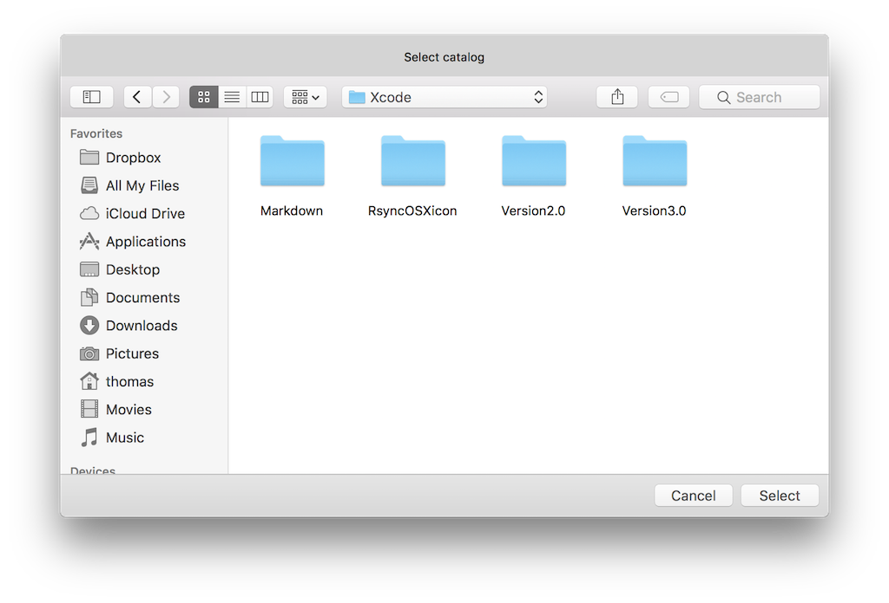
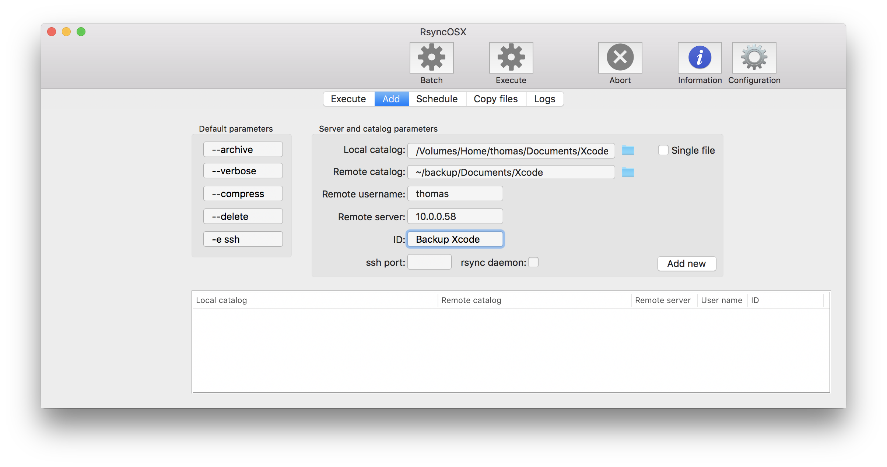
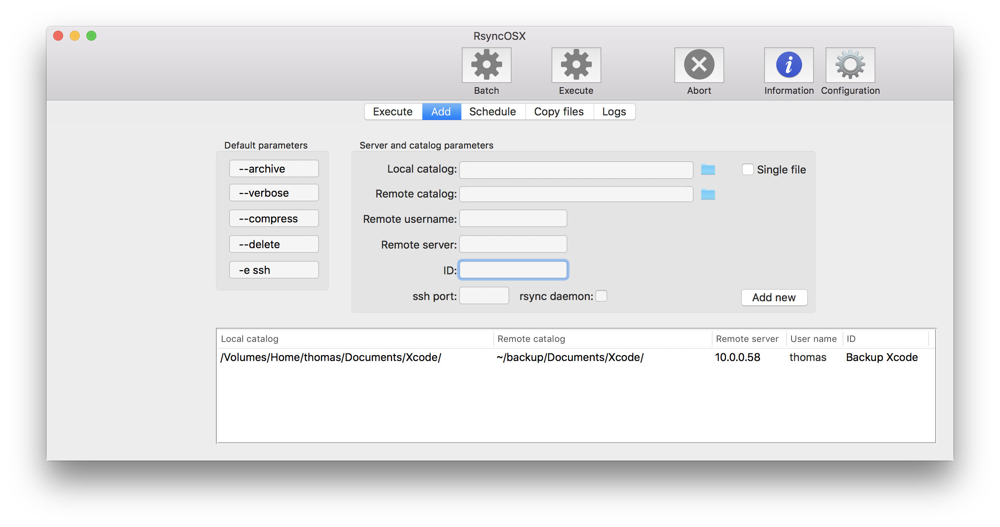
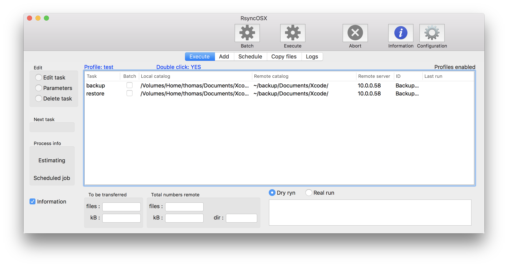

## Add configuration

Index of [RsyncOSX documentation](https://rsyncosx.github.io/Documentation/).

Adding configurations is easy. A configuration require minimum **Local catalog** and **Remote catalog**. And they cannot be equal (obvious). After entering information about a configuration select the Add button to add it to RsyncOSX. Continue adding new configurations until completed and configurations are saved to permanent store when choosing another tab (as Execute or other).

Select **Local catalog** either by *drag and drop*, by *enter text* directly or by *GUI* (press the folder icon). For **Remote catalogs** only drag and drop or GUI for local volumes. For remote server catalogs enter by text only.

### Single file

If **Single file** is *on*, RsyncOSX adds backup of single file only. No restore part is added, use Copy files for search and restore.

### Local and remote catalogs

Local catalog and Remote catalog (if not on remote server) is added either by using *drag and drop* from filemanager or *by GUI* (select the icon) or *by text* only. If enter by text please rember to add the full path. Remote catalogs is entered either by full paths or use the `~` character to expand remote user home catalog (if remote backup catalog is in users home catalog somewhere). See sample configuration below.

### Sample configuration

The screen below is all information about my configuration for a virtual FreeBSD instance running on my Macbook Pro.

- **Local catalog**: - `/Volumes/Home/thomas/Documents/Xcode/` - src catalog RsyncOSX
- **Remote catalog**: - `~/backup/Documents/Xcode/` - the backup catalog for user thomas. The `~` is expanded as the home catalog with full path by the remote operating system. The remote catalog might also be added by full path `/home/thomas/backup/Documents/Xcode/`
- **Remote username**: - `thomas`, username remote server
- **Remote server**: - `10.0.0.58` either name or IP-adress
- **ssh port**: - if ssh communicates through other than standard `port 22` it must be set here. As an example in Virtualbox I have set up a port forwarding through `port 3022` -> Virtualbox `port 22`.
- **ID**: - `informal tag` for the configuration
- **rsync daemon**: - setting this puts a double colon `::` in address parameter to rsync. It forces rsync to use the rsync daemon remote which takes some more setup. I am not using it myself.

### The Add button

Select the `Add` button when completed and configuration is added to RsyncOSX. RsyncOSX adds a trailing `/` character to both local and remote volume (if the `Single file` is not on). Both the **backup** and **restore** part are added when saving new configurations. After selecting the Add button another configuration might be added. Any changes (edit or delete) to configurations are done from the main view (Execute tab).

If `Single file` is ticked on no trailing character `/` is added and only backup task is added.

Go back to Execute tab and there are two new rows, one for **backup** task and one for **restore** task.

