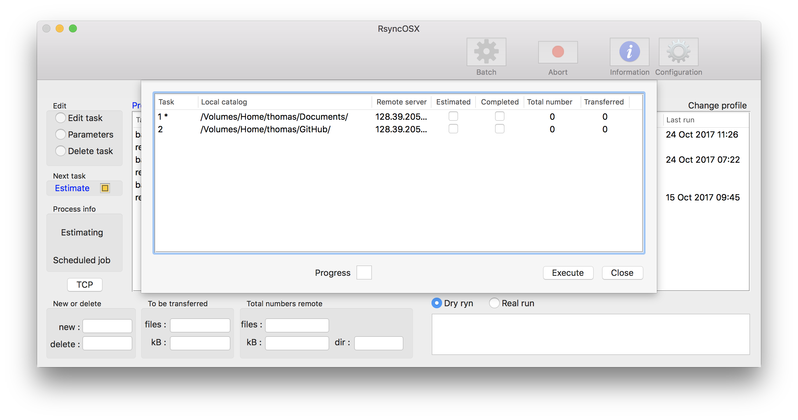

## Execute tasks in batch

Index of [RsyncOSX documentation](https://rsyncosx.github.io/Documentation/).

Only **backup** tasks can be set for execution in batch. All tasks marked for batch is presented in screen for batchtask. Choosing `Execute` executes all tasks in **one go**, both the **estimation** and **real run**. The screen is updated as the process of execution is going forward. After all tasks are completed the view closes automatically in 10 seconds (if not closed before).

Selecting the `Abort` button (the `Close` button becomes `Abort` button when Execution is selected) aborts any remaining tasks.

