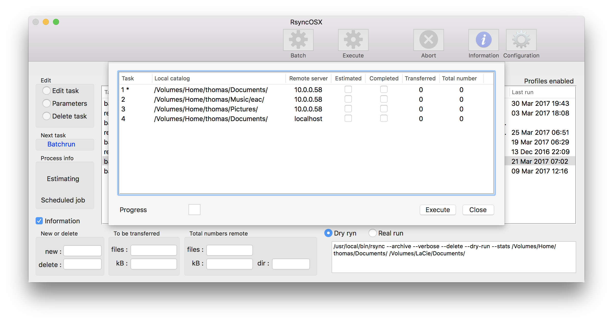
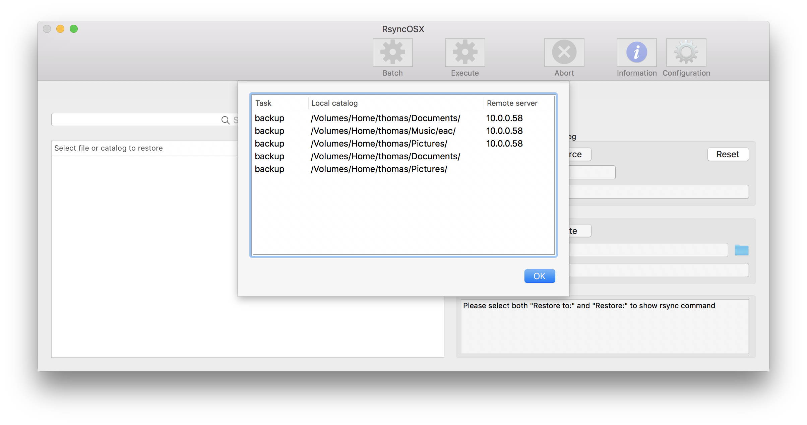
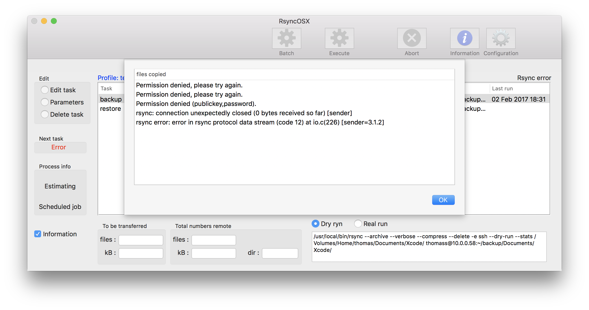
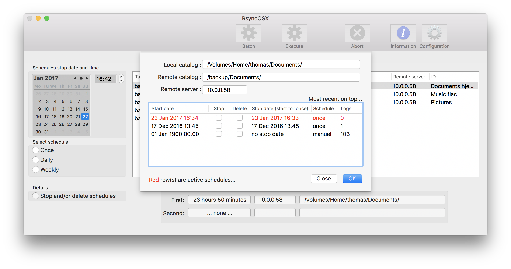

# Changelog

Index of [RsyncOSX documentation](https://rsyncosx.github.io/Documentation/).

I am using the application on a daily basis and it evolves during my own use. Any suggestions for new _features_, _changed features_ and _bug reports_ are more than welcome. 

Please add an [Issue](https://github.com/rsyncOSX/Version3.x/issues) regarding any requests or bugs.

## Source code

The [code](https://github.com/rsyncOSX/Version3.x/tree/master) is **not** example of neither writing _decent Swift code_, _OO-development_ or _applying the MVC-pattern_. It all started as a project to learn the _basics_ about Swift and Xcode. And I am still learning, every day. I am not a professional developer, this is for fun only. Coding is an art and to be really good at coding requires years of experience. My experience of coding is far from that ;-) But I am happy to share the code with anyone interested. Sharing of code is in my opinion the best way to get quality.

## Version 4.2.0

* released 10 April 2017
* compiled with new release of Xcode (version 8.3.1)
* enhanced the batchwork part
* fixed a couple of minor bugs
* some cleanup in code
* reorganized Help
* there is an issue when RsyncOSX counts files to be transferred in *batchmode*, the issue does not introduce any faults (informal only)
* there is also an issue when RsyncOSX is logging, sometimes RsyncOSX does log 0 files and not the actual number of files and size of transfer (informal only)

## Version 4.1.0

* released 19 March 2017
* fixed one bug in parameters to rsync (causing RsyncOSX to crash)
* new help function - opens relevant html page in browser
* added new info using rsync version 3.1.2 (number of *new* and *delete* files)
	* see [user configuration](UserConfiguration.md) how set other version of rsync

## Version 4.0.0

* released 8 March 2017
* new application icon by Forrest Walter (this is the primary reason why releasing a new version)
* added new functionality in `Copy files` - double click on source get list of files from remote server

## Version 3.9.7

Sometimes rsync throws errors and does not execute as expected. Single task is implemented as queue of work (`estimate`, `execute` and `done`). If `estimate` or `execute` failes (by some reason) the user has to be made aware of situation and fix it. 

RsyncOSX checks output from rsync for string *rsync error:*. If found main view is notfied, error is marked (in red) and work queue is reset if option in userconfig (see below) is set. To test enter a not valid user name for a remote server ([edit task](SingleTask.md) in main view).

Other changes:

- released 2 March 2017
- some refactor and several cleanup of code
- Added reporting any file errors (in profile) to main view. 
- There is also fixed a minor bug in Profiles.
- In About menu reference to GitHub Pages about Changelog and Documentation of RsyncOSX

See [releases](https://github.com/rsyncOSX/Version3.x/releases) for download.

## Version 3.9.5

Version 3.9.5 might **crash** for some user. This is due to localised string representation of dates in logs. RsyncOSX only accepts `en_US` format of dates in logs. Comparing and sorting other localised string representation of dates causes a crash.

If RsyncOSX crash during startup please delete the schedule and logfile: `Documents/Rsync/MacID/scheduleRsync.plist` (deleting this file only deletes any schedule and logs).

- released 28 January 2017
- I´m not adding any major new functionality to RsyncOSX, only minor enhancements.
- the focus in this release candidate is to make logs more informal and stable
- logs are now sorted with most recent log on top (first row in table)
- active schedules are marked red
	- number of logs in each schedule
	- manual execution of tasks are logged under start date `1 Jan 1900 00:00`
- dates are forced to "en_US" localisation to prevent RsyncOSX from crashing if the preferred language of macOS is other than english (e.g. Norwegian)

## Version 3.9.1
- released 19 January 2017
- added a few tweaks regarding radiobuttons in main view and deselect row after delete actions
- moved Add button new configurations into tab view and added some more checks when adding new configurations
- In Sch

## Version 3.8.6
After releasing this version I will not release new versions for some time. I have to focus on my new job (start 2 January 2017) for some time. I will continue to develop RsyncOSX in the future, but the number of new releases will drop compared to 2016. 

- fixed bug in profiles
- added an alternative suffix (in [parameters](Parameters.md) to rsync)
- added delete log rows in log view
- even more cleanup of code

## Version 3.7.7
- released **23 December 2016**
- fixing one bug in Profiles introduced another bug causing logs to be overwritten

## Version 3.7.6
- released **23 December 2016**
- fixed yet another bug in Profiles
	- bug causing old configurations and schedule data not properly cleaned when new profile is created
- compiled with latest version 8.2.1 of Xcode
- the are several parts of code which is refactored
	- cleaned up external references (in About and NewVersion)
	- added guard statements to make code safer 
	- fixed a bug in Main.storyboard referring to a non existing class
	- refactor of computing parameters to rsync

## Version 3.7.2
- fixed a bug in set optional path for rsync

## Version 3.7.1
- updated **13 December 2016**, compiled with new version 8.2 of Xcode released 12 December 2016
- released **10 December 2016**
- fixed a bug `--suffix` parameter used together with `--backup` parameter to set date and time suffix (e.g `changed-file_2016-12-10.15.25`) of changed or deleted files in backup directory
- split `--backup` parameter and `--suffix` in parameter view
- refactor of code for rsync parameters and logging
- speed of sorting and filter logs improved
- added display both `--dry-run` and `real run` of rsync command in main view

## Version 3.6.5

- released **23 November 2016**
	- this will be the last release for some time (most likly last release this year)
	- there are no known issues or request for new features
	- I will continue develop RsyncOSX in 2017, there are some internal parts which should be refactored
- new About view (links to docs, changelog and check for new versions)
- fixed a bug in Edit configurations (reset values when new configuration is loaded)
- some minor cleanup of code

## Version 3.6.1

- released 15 November 2016
- [logs part](Logging.md) is changed, text search for **remote server**, **local catalog** or **executed date/time**
- there is a bug in deleting ssh-port - **fixed**
- there is a bug in enabling Profiles menu when RsyncOSX is started on a Mac for the first time (Profiles menu is not enabled) - **fixed**
- sometimes output from rsync is set to **nil** (in RsyncOSX), doing an unwrap of nil value causes RsyncOSX to crash - **fixed**

## Version 3.5.5

- new image updated **10 November 2016** : some minor GUI tweaks and automatic dismiss after 10 seconds in some of the views
- new image updated **5 November 2016** : if selecting new profile before background check for connection is completed RsyncOSX might crash, fix is done and new image is uploaded. Background check is executed when main view loads and remote servers not responding is marked red.
- released 3 November 2016
- fixed a couple of bugs in automatic dismiss of popup views (when scheduled backups are running and in main view a popup informs of backup)
- some minor refactor of code

## Version 3.5.1

- new image updated **2 November 2016** : added check for optional version and path of rsync
- new image updated **1 November 2016** : "moved" GUI updates in background (Scheduled operations) to main thread - making RsyncOSX unstable if not - throwing "CoreAnimation: warning, deleted thread with uncommitted CATransaction" if not
- **caution** : a bug in Scheduled jobs caused version 3.5.1 released 30 October 2016 to crash - a new image of version 3.5.1 uploaded late 30 October 2016.
- released 30 October 2016
- fixed a bug in version 3.5.0 deleting/stopping schedules causing a nil pointer exception and crash
  - bug was "introduced" when compiling RsyncOSX with latest release version 8.1 of Xcode
- notify new versions of RsyncOSX by delegate
- mainly a maintenance release, some bigger internal changes and some GUI tweaks
- RsyncOSX is more stable than ever
  - replaced states by work queue (using states get complex even with a few states)
  - I am learning Swift every day and [refactor code](https://en.wikipedia.org/wiki/Code_refactoring) is important
- code ([master](https://github.com/rsyncOSX/Version3.x/tree/master)) at Github is updated with last commits
- added double click for executing single task and select profile
  - double click first time executes a dry run, another double click after dryrun executes the real task
  - enable/disable double click in user configuration

## Version 3.4.1

- released 20 October 2016
- copy and paste was by mistake not in 3.4.0 - now it is...
- there was an issue with Copy files (search and copy single files or catalogs) - if you experience any problems with copy files in version 3.4.1 please update to last image of version 3.4.1

## Version 3.4.0

- released 19 October 2016
- added profiles - select profiles from the File meny, profiles is just new catalogs for storing configurations and schedules files.
- backup of single files in Add view, only backup part is added for single files, use Copy Files to search and restore single files
- some minor internal cleanup and fixes, adjusted Copy Files view
- added abort in Copy Files (terminates search process)
- in logs view selecting row selects logs for selected remote server
- removed test mode in RsyncOSX - replaced by profiles
- user configuration available from Main tab, Add tab and Schedule tab
- in main tab when rsync is changed in user configuration, if row is selected rsync command in view is updated
- counting of files and directories from rsync output is more robust, only version 3.x of rsync counting directories remote

## Version 3.3.0

- released 6 October 2016
- capture of more precise info about files, tested on both stock version on rsync and 3.1.2 of rsync (only version 3.x counts directories)
- fixed a bug not saving path for other version of rsync
- added backup in rsync parameters
  - changed files are moved to backup location (default ../backup) and appended a timestamp before updated files are transferred from source to destination
  - useful when saving versions of e.g. documents
- fixed a memory leak in scheduling of tasks
  - after the last release 4 Oct 2016 it seems that there are no memory leaks (at least the graphic memory debugger in Xcode reports no leaks as well as the Xcode instrument Memory Leaks)

## Version 3.1.5

- released 24 Sept 2016
  - image is updated 26 Sept 2016 (fixed a few minor glitches)
- added detailed logging
  - logging switch on/off in Configuration
- hopefully no more releases for some time after this release

## Version 3.1.0

- updated 22 Sept (released 20 Sept 2016)
- scheduling of tasks
- added (22 Sept 2016) adding local volumes by graphical window or drag and drop from Finder
- a few minor bug fixes (22 Sept 2016)

## Version 3.0.5

- updated 15 Sept 2016
- copy of single files or catalogs from remote storage
  - doing a restore require to press the Estimate button twice, once for a -- dry-run (estimate) and the the real run (execute)
- some visual enhancements
- Scheduling of tasks is **not yet** included in this version (will be in version 3.1.0)
  - tasks might be scheduled in version 3.0.5 but not executed

## Version 3.0.0

- built on macOS 10.12 GM by Xcode 8 GM (GM = "gold master")
- supports macOS 10.11 and macOS 10.12

What is **NOT** implemented in version 3.0

- no execution of Scheduled task, but scheduled task may be added, stopped and deleted
  - the code for execution of scheduled tas has to be revised and tested
  - will come in version 3.1.0
- no copy of single files or catalogs from remote servers
  - will come in version 3.1.0
- no detailed logging
  - will come in version 3.1.0

## Changelog prior version 3.0.0

Changelog prior to version 3.0.0 is deleted. The initial release was 14 March 2016 and code is rewritten since the initial release.

## Version 0.5 beta

- initial listing 14 March 2016, released on MacUpdate as well
