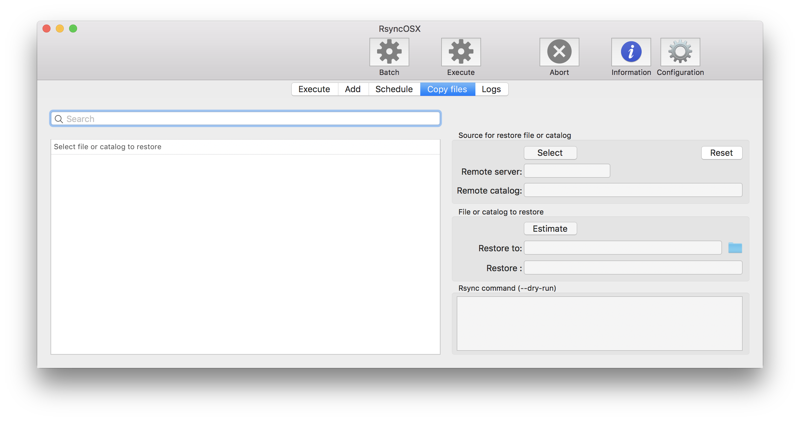
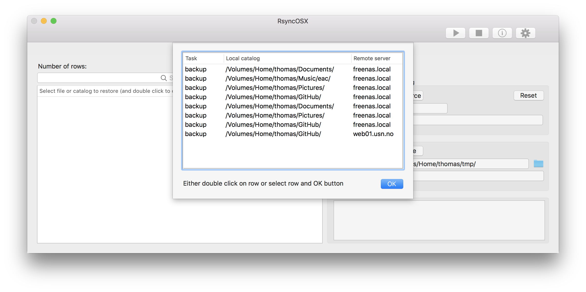
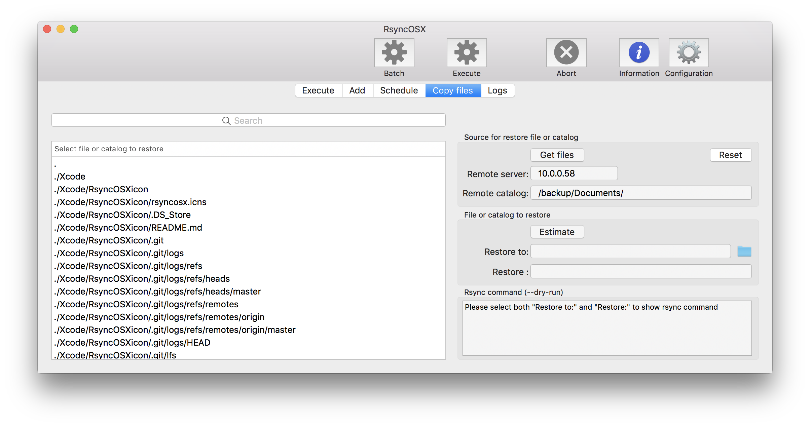
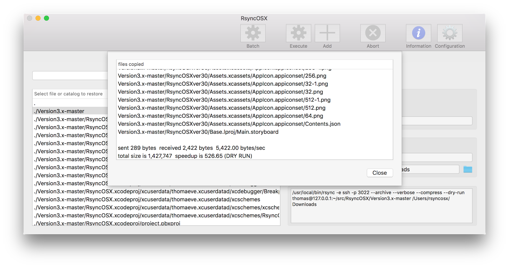
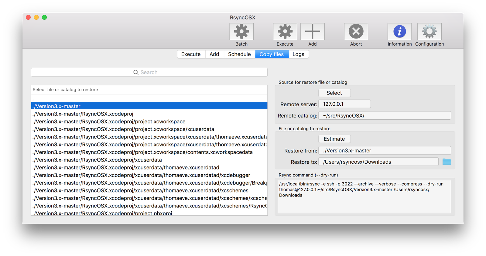

## Copy single files or catalogs

Copy file and volume enables the user to select single file or catalogs for restore to a selected local storage. The _source_ for copy is either _selected row in Execute view_ or if selecting `Select` button drop down list of all backup locations. 

* button is labeled `Select` if no location is selected in main view, pressing select pops up a list of backup locations
* button is labeled `Get files` if location is selected, either in main view or by drop down list (information about source is filled in)
* if `Reset` button is selected button is labeled `Get source`, if selected list of source is listed in drop list

Pressing `Get files` button starts the job to collect list of files and catalogs stored on remote server. Or job to get files is started by double click on row in list of sources.

All backup locations are presented.

Double click on row gets list of files from backup location. If single clikc select `Get files`.

List of files and folders stored at remote server.

Remote file or catalog is selected and restore point is set.

After selecting pressing the Estimate button instructs rsync to do a --dry-run.

