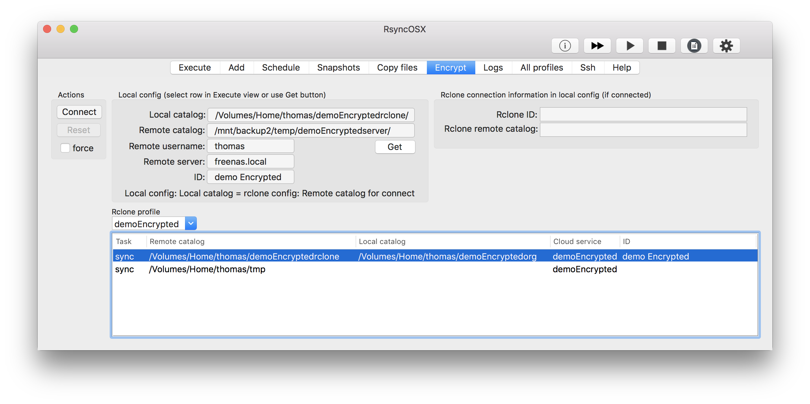

## Encrypted backups

Index of [RsyncOSX documentation](https://rsyncosx.github.io/Documentation/).

`Rsync` does not support encrypted backups. It is probably possible to do encrypted backups utilize filesystems as [encfs](https://github.com/vgough/encfs). By combining rclone and rsync in RsyncOSX encrypted backups is enabled in a two step operation.

[Rclone](https://github.com/ncw/rclone) is "a rsync for cloud storage" command line tool. I have developed RcloneOSX which is a GUI utilizing rclone. RcloneOSX is a minor version of RsyncOSX, but for simple backups it works.

## Encrypted backups utilizing RcloneOSX and RsyncOSX

In rclone, add a [encrypted](https://rclone.org/crypt/) remote. The remote envrypted catalog in rclone config is set to `/Volumes/Home/thomas/demoEncryptedrclone`. The cloudservice in rclone config is named `demoEncrypted`. In RcloneOSX add source and backup location utilizing the encrypted remote. I have set up rclone to encrypt files, filenames and catalogs by using maximum encryption key length. I have set up RcloneOSX to do encrypted backups of my `demoEncryptedorg` catalog to a locale catalog `demoEncryptedrclone` by utilizing the encryption functionality  within rclone.

In the view below the first task is to sync and encrypt backups by RcloneOSX. The second task is to sync and decrypt the local encrypted backup to a temporary catalog.

