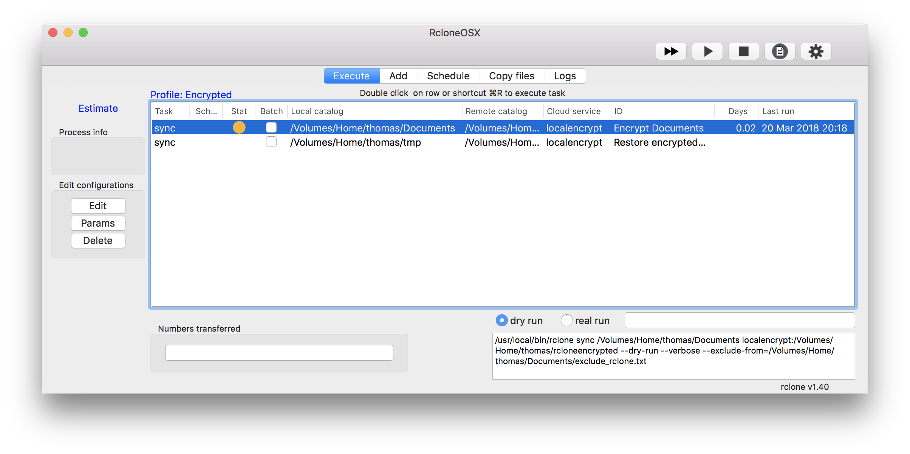
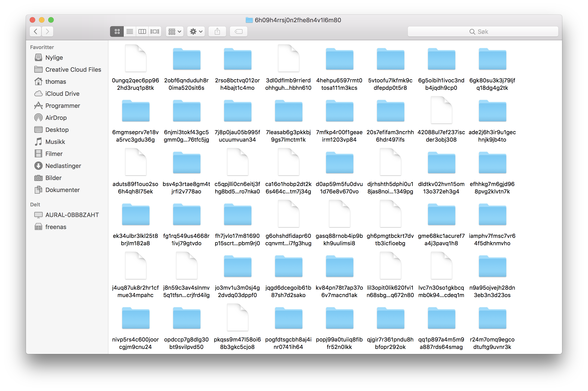
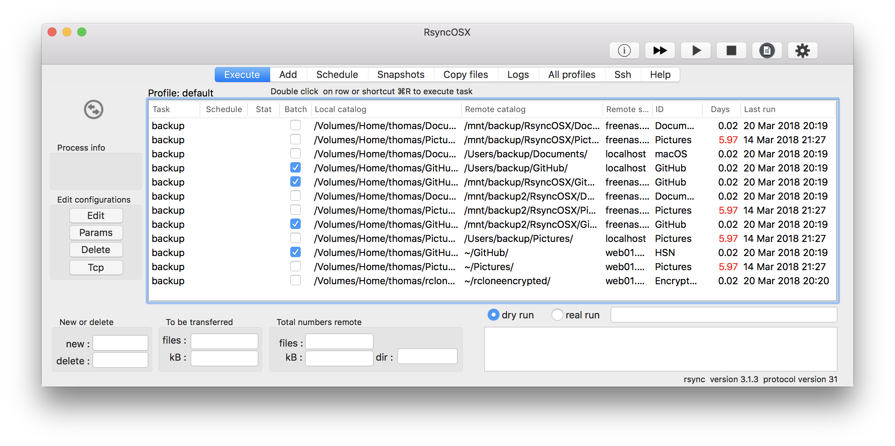

## Encrypted backups

Index of [RsyncOSX documentation](https://rsyncosx.github.io/Documentation/).

RsyncOSX does not support encrypted backups. It is probably possible to do encrypted backups utilize filesystems as [encfs](https://github.com/vgough/encfs). I have found another solution which require two steps. Until now I have not backup up my Documents catalog on remote servers due no encryption of data.

[Rclone](https://github.com/ncw/rclone) is "a rsync for cloud storage" command line tool. I have developed RcloneOSX which is a GUI utilizing rclone. RcloneOSX is a minor version of RsyncOSX, but for simple backups it works.

## Encrypted backups utilizing rclone

In rclone, add a [encrypted](https://rclone.org/crypt/) remote. In RcloneOSX add source and backup location utilizing the encrypted remote. I have set up rclone to encrypt files, filenames and catalogs by using maximum key length. I have set up RcloneOSX to do encrypted backups of my `Documents` catalog to a locale catalog `rcloneencrypted`.

In the view below the first task is to sync and encrypt backups by RcloneOSX. The second task is to sync and decrypt the local encrypted backup to a temporary catalog.

The encrypted catalog `rcloneencrypted` looks like:

By utilizing RsyncOSX I am syncing the encrypted catalog `rcloneencrypted` to a remote server.

To restore a file reverse the above process.
