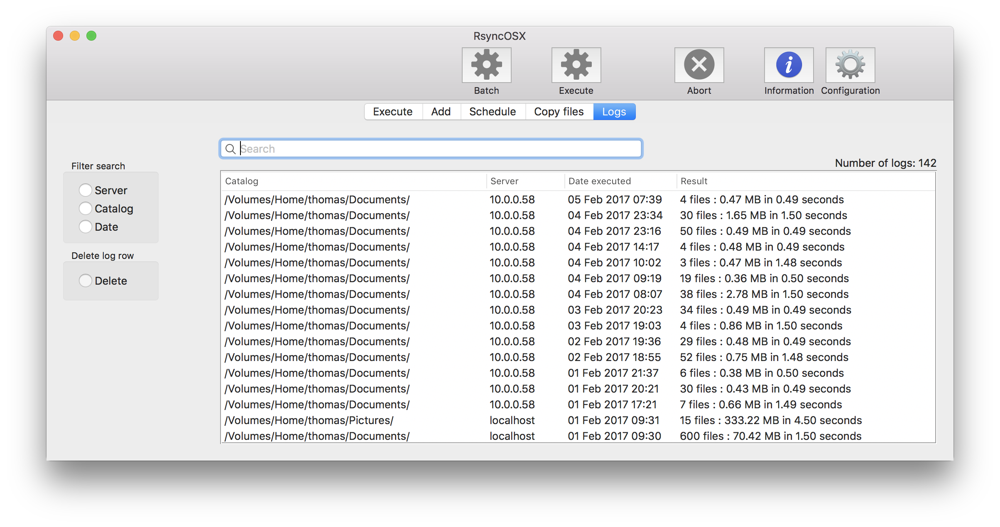

## Important notes about rsync and RsyncOSX

RsyncOSX is a GUI for the rsync command-line tool. The main uses are:

- backup (and restore) local files on Mac to remote servers connected to Internet or local network
  - the above is why I wrote RsyncOSX to use myself
- backup (and restore) local files on Mac to local storage (attached disks)
  - if this is _the only use_ there might be _other tools_ more useful than RsyncOSX

**Warning**: default parameters for rsync is to **synchronise** the **source** and **destination**. A "restore" will **delete** all files in the source which are not in the destination. The main objective to RsyncOSX is to keep the **source** directory and **destination** (backup) directory **in sync**. When a source directory is backed up, the destination is 100% in sync with source in the moment the backup task is completed. There are **no revisions** of files in the backup in **default RsyncOSX**. Old files in the backup are either replaced with new ones or deleted if so is true in source.

- _source_: the local volume to be copied
- _destination_: the remote location where source files and catalogs are copied

What about **revisions and deleted** files? In the [parameters to rsync](https://github.com/rsyncOSX/Documentation/blob/master/Docs/Parameters.md) there is presented a solution by parameters to rsync, to save changed and deleted files in a selected backup location.

## Why use RsyncOSX?

There is only one simple answer to the question and the answer is [rsync](https://en.wikipedia.org/wiki/Rsync). Rsync is a _rock solid_, _well proven_, _secure_, _fast_, _reliable_ and _wide accessibility_ across platforms command line tool. RsyncOSX is just a GUI for executing rsync commands. Rsync is a command line tool with tons of parameters. Choosing the right parameter and to get the predicted result from rsync might be a challenge. RsyncOSX does the job for you. RsyncOSX also stores configurations in profiles and makes it easy to use different configurations.

The following features are implemented in RsyncOSX:

- execute **single** tasks
  - an *estimation* run is required before the real task is executed (an estimation run is executed by the setting the `--dry-run` parameter to rsync)
  - either by a double click on row or by pressing the Execute button **after** the estimation progress indicator has stopped executes the real task
  - if another row (task) is selected after estimation is done a new estimation run is required
- execute **batch** tasks
  - batch tasks are automatically executed until all are completed (the estimate run and execute run are executed in one go)
  - if you want tasks to be executed in one go mark them for batch
- adding **new tasks** either by drag and drop (for local volumes) or by GUI
- **user configuration**
  - the user can select other versions of rsync
- **abort** single- and batch tasks
- **rsync parameters**
  - the user can add parameters to rsync
  - there are predefined parameters for saving old files in a backup directory
- **enable** saving backups of changed or deleted files (in rsync parameters)
- **delete** and **edit** configurations
- store configurations in **profiles**
	- as many profiles as wanted
- **copy of single files or volumes** from remote storage
- **scheduling of tasks**
- **detailed logging**
  - switch on/off

## RsyncOSX is not suitable to all users

The primary objective for me to write and use RsyncOSX is for storing backup of local volumes to _low cost remote server_ and assist me to keep my _two MacBook desktops in sync_. The remote servers might be running either Linux, Solaris, OpenSolaris, FreeBSD or other BSD based server OS. To set up and use all the functionality of RsyncOSX require some computer skills as login to a remote server (from terminal) and set up private/public key based ssh password-less login. Some basic understanding of the command-line tool rsync is also recommended.

Any user just looking for an easy to use backup tool is advised to use other and probably more suitable tools than RsyncOSX. To fully understand and use RsyncOSX I recommend the following:

- you have some understanding of the command-line tool rsync
- you have some knowledge about running either Linux, Solaris, OpenSolaris, FreeBSD or other BSD based server OS
- you are able to [setup a ssh password-less login](https://github.com/rsyncOSX/Documentation/blob/master/Docs/PasswordlessLogin.md) between the Mac and the remote server

## The main opening view

All configurations to execute are listed in table. From this screen all actions (edit configurations, adding parameters to rsync, delete configurations) regarding configurations are executed.

There are two labels on top of table : **Profile** and **Double click: YES**. Configurations can be saved in user selected profiles. The profile in use is shown in label `Profile : name`. `Double click:YES` (or NO) either allow or dont allow executing single tasks by double click on row. Disable or enable in Configuration.

### Profiles

RsyncOSX uses profiles. If not used all configurations are saved in the default profile. Which profile in use is labeled on left top of table.In the profiles menu there are two options:

- new profile (name of new profile must be set in `New profile name`)
- delete profile

Selecting the `Default` button selects the default profile. **Double click** on a profile name to select the profile.

### Logging

RsyncOSX is logging all tasks. The user can choose in userconfiguration, to disable or enable detailed logging. Detailed logging is on as default. In log view all tasks with date, number of files and size transferred is logged. In the main view date and time for last execution is set.

## RsyncOSX configuration files

RsyncOSX configuration file, log file, scheduled tasks file and user configuration are plain XML-files ([property list files](https://en.wikipedia.org/wiki/Property_list)). Configuration files (backup and restore task configurations and schedule data) are saved in:

- `~/Documents/Rsync/MacID/configRsync.plist`
  - `~/` is user home directory
  - `MacID` is the Mac serial number and is automatically set by RsyncOSX

If _profile_ is used:

- `~/Documents/Rsync/MacID/profile/configRsync.plist`
  - `profile` is the profile identification