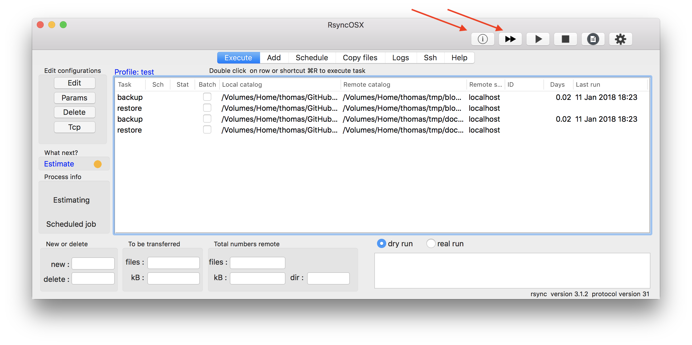
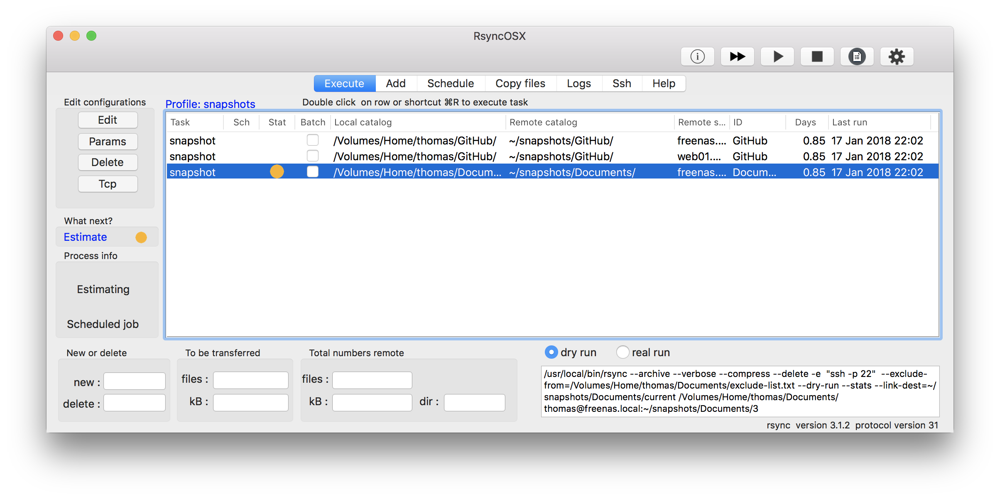
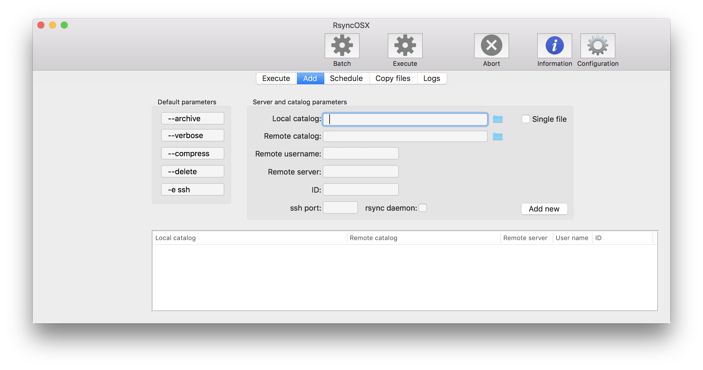
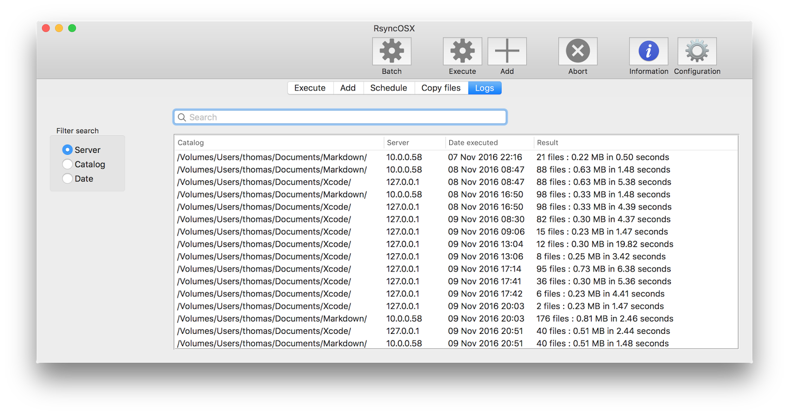
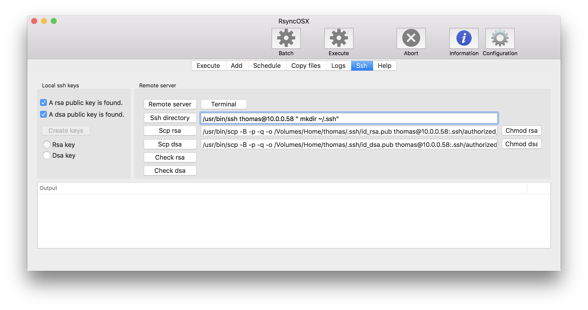

## The main opening view and a short intro to RsyncOSX

Index of [RsyncOSX documentation](https://rsyncosx.github.io/Documentation/).

This page is a short intro to RsyncoSX and a brief walkthrough of the main functions of RsyncOSX. The intro is based on functionality in *version 4.9.1* of RsyncOSX. Some of the screenshots are previous versions. For more details about the various functions of RsyncOSX please see the documentation about each function. Make sure you understand the basics about how rsync works before using RsyncOSX (and rsync).

All configurations to execute are listed in table. From the main view most actions (edit configurations, adding parameters to rsync, delete configurations) regarding configurations are executed. Configurations can be saved in user selected **profiles**. The **profile** in use is shown in label `Profile: name`. **Information** about *new:*, *delete:* files and *remote number* of directories are only available if version 3.x of rsync is used.

## Type of tasks

From version 5.0.0 of RsyncOSX, there are three types of how to synchronize source and destination (backup):
- synchronize source and backup location, any changed and deleted files in backup location will be deleted
  - this is the standard synchronize task in RsyncOSX, after execution source and destination (backup) is 100% in sync
- as above, but you might add a [parameters](Parameters.md) to rsync to save changed and deleted files in a separate backup catalog
- [snapshot](Snapshots.md) tasks, a snapshot of previous synchronize task is stored before a new task is executed, number of snapshots are user defined, copy deleted or previous versions of files from snapshots

All types of backups

## Check remote servers

The red rows indicates no connection to remote server. Selecting the TCP-button executes the check and marks configurations not available (no contact with remote server) red. RsyncOSX does a **background** check (informal only) for remote servers. The server `freenas.local` is a local NAS server (FreeNAS) and RsyncOSX does not find `freenas.local` outside my home and marks configurations red in table view.

## How to execute any kind of task

There are **five** ways to execute tasks (`backup` tasks only).
- (1) single task, a double click on a row executes first a test run (`--dry-run`), the next double click executes the real run
  - selecting another row after a `--dry-run` resets the work queue
- (2) quick backup
  - select which tasks to execute in one go, selection is not saved
  - start with dynamic view of local vs remote storage, selecting tasks to execute automatically opens the quick backup menu with preselected tasks
- (3) `⌘R` - shortcut for immediate execute task after selecting a row
  - if a task is executed by shortcut `⌘R`, a select of another row during execution will terminate (abort) the current task
- (4) mark backup tasks for batch, select the batch button executes all tasks marked for batch in one go
- (5) schedule a task, scheduled tasks are executed according to date and time, either once, daily or weekly

All tasks can be aborted during execution.

Due to how a `restore` works a restore can only be executed by a test run (`--dry-run`) before the real run. This is a precaution (see warning at top of page). Files can also be restored by using the [copy single files](CopySingleFiles.md)

### (1) Single tasks

Selecting the row indicates a estimate run is next. A **double click** on row executes the task. Next task is a *Estimate* run as indicated on left in main view. An *estimate* run is a `--dry-run` execution of rsync. The result of a estimate run is presented. Next task is *Execute*, the real run.

See [single task](SingleTask.md) for more info.

### (2) and (3) Quick backup and `⌘R`

Quick backup executes backup and snapshot tasks in one go. There is no `--dry-run` ahead of real task. You have to select tasks for quick backup every time. You can also select a row and press `⌘R` (shortcut) for immediate execute task.

See [quick backup](Quickbackup.md) for more info.

### (4) Batch mode

Tasks can be executed in one go in batch mode. Tasks are preselected for batch. During batch RsyncOSX executes a a `--dry-run` ahead of real run.

See [batch task](BatchTask.md) for more info.

### (5) Schedule tasks

Only **backup** or **snapshot** tasks can be scheduled.

See [menu app](Menuapp.md) for more info.

## Snapshot tasks

Snapshot tasks is a variant of normal backup tasks. The main difference is that old and deleted files are saved in previous snapshots.

See [snapshots](Snapshots.md).

## Adding configurations

It is easy to add new tasks. RsyncOSX adds both the backup and restore part of task automatically.

See [add configurations](AddConfigurations.md) for more info.

## Copy files

Files and directories can be restored from remote servers. It is easy to search for files or directories to restore.

See [copy files](CopySingleFiles.md) for more info.

## Logging

RsyncOSX is logging all tasks. The user can choose in user configuration, to disable or enable detailed logging. Detailed logging is on as default. In log view all tasks with date, number of files and size transferred is logged. In the main view only date and time for last execution is set.

See [logging](Logging.md) for more info.

## Ssh

Setting up password less logins is required to backup files to remote servers. RsyncoSX can assist in setting up password less logins.

See [ssh](ssh.md) for more info.

## Rsync errors

Sometimes rsync throws errors. RsyncOSX does a simple check in output if there are any occurrence of the words `rsync error:`. If found RsyncOSX resets the work queue. This is *not* an advanced error handling.

## User configurations

Some configurations can be set on or off by the user.

See [user configuration](UserConfiguration.md) for more info.

## Rsync parameters

The user can pass any parameter to rsync or choose some predefined parameters.

See [rsync parameters](Parameters.md) for more info about user selected parameters and [default parameters](RsyncParameters.md) about default parameters.

## Profiles

RsyncOSX uses profiles. If not used all configurations are saved in the default profile. Which profile in use is labeled on left top of table.

**Double click** on a profile name to select a profile.

In the profiles menu there are two options:

- `OK`. Name of new profile must be set in `New profile name` before `OK` button is selected. If `New profile name` is empty the view is closed (not loading a new profile).
- `Delete` profile. Select profile to be deleted in list of profiles and select `Delete` button to delete.
- `Default` button selects the default profile.

## RsyncOSX configuration files

RsyncOSX configuration file, scheduled tasks which also includes log records and user configuration are plain XML-files ([property list files](https://en.wikipedia.org/wiki/Property_list)). Files are saved in:

- `~/Documents/Rsync/MacID/configRsync.plist` - configurations
  - `~/` is user home directory
  - `MacID` is the Mac serial number and is automatically set by RsyncOSX
- `~/Documents/Rsync/MacID/scheduleRsync.plist` - scheduled tasks including log records
- `~/Documents/Rsync/MacID/config.plist` - user config

If _profile_ is used:

- `~/Documents/Rsync/MacID/profile/configRsync.plist`
- `~/Documents/Rsync/MacID/profile/scheduleRsync.plist`
  - `profile` is the profile name
- `~/Documents/Rsync/MacID/config.plist` - user config
