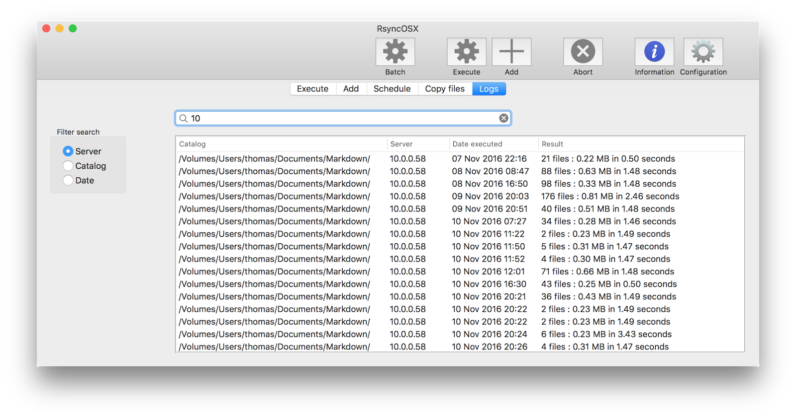

## Logging

Index of [RsyncOSX documentation](https://rsyncosx.github.io/Documentation/).

Detailed logging in RsyncOSX might be switched on/off in user configuration. Only **backup** tasks are logged. All loggdata is by default listed in table within Logs view (sorted by date). Loggdata can be _filtered_ by text search in:

- **Server** (remote server)
- **Catalog** (local catalog)
- **Date**

There are two ways to filter loggdata by search field. If a row is selected loggdata is filtered by one of the three subjects depended upon which radio button is on.

If no row is selected, text can be entered in search field and by selecting one of the radio buttons loggdata is filtered by matching text and subject by radio button. Cancel search field reloads all loggdata.

All loggdata is by default listed in table.

**Issue about logging:** if only a few and small files (in size) is transferred it is most likely thats logs shows 0 only. The rsync command is executed by a [Process](https://developer.apple.com/reference/foundation/process) object. There are methods to monitor when executed task terminates and when the task ouputs data (to console). The logging in RsyncOSX is triggered by a `process termination` notification (see [processCmd.swift](https://github.com/rsyncOSX/RsyncOSX/blob/master/RsyncOSX/processCmd.swift)). Normally all output data is monitored before `process termination` is observed. Sometimes, when transferring a few and small files,  a `process termination` is observed before output data is monitored. Hence no data to log.

### Server

loggdata can be filtered by (remote) server. In the view below all servers containing 10 is filtered.

If a row is selected loggdata is filtered by server name (full name or IP-adress).

To list all loggdata again press the cancel within search field.

### Catalog

The local catalog might also be filtered. Loggdata is filtered by selecting local catalogs containing Xcode.

### Date

Date might also be filtered. Loggdata is filtered by dates containing 11 Nov.

