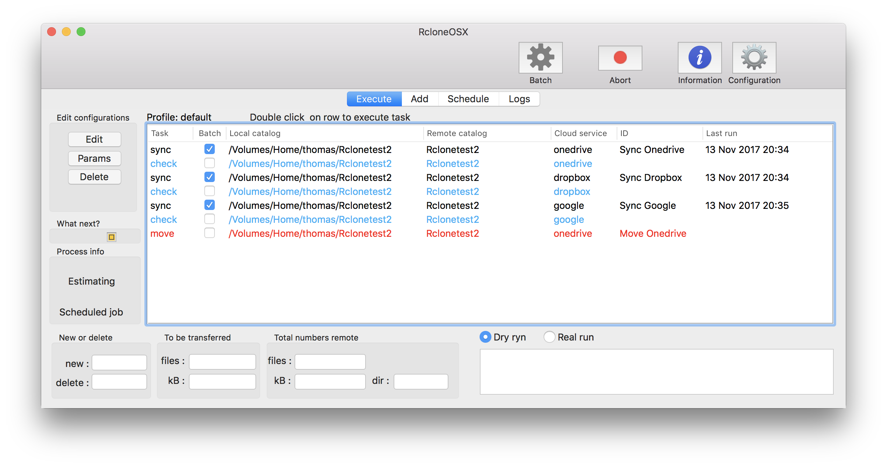
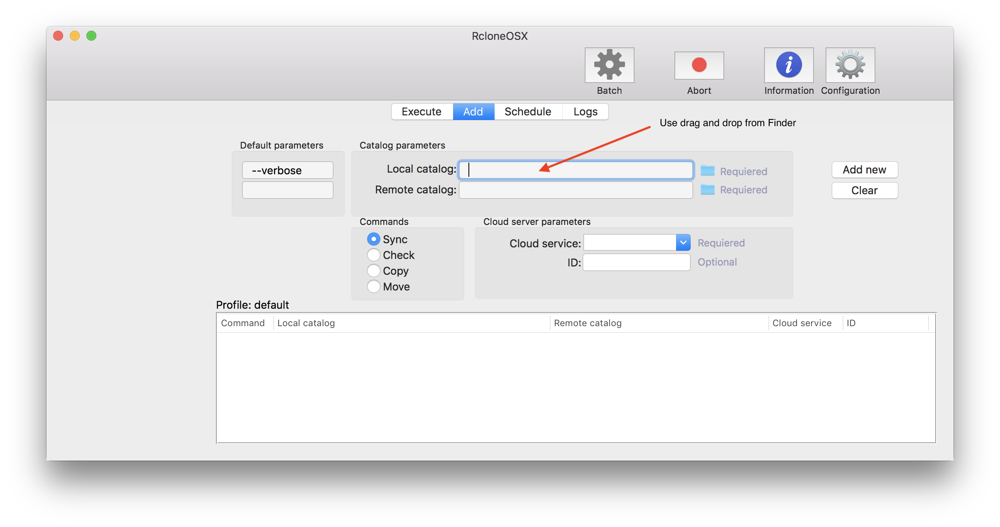
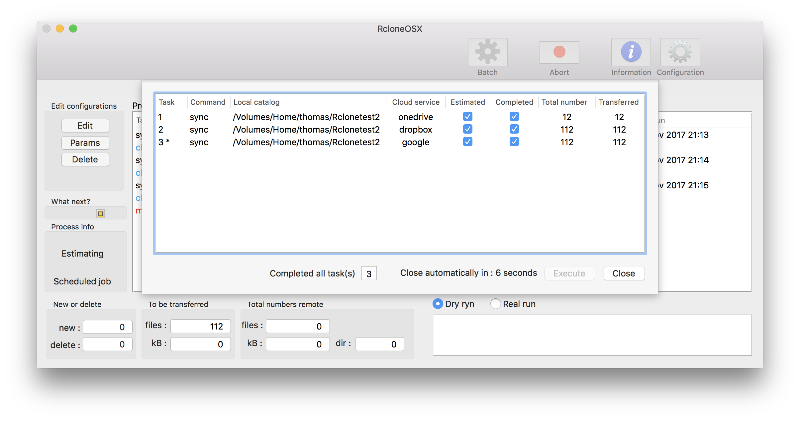
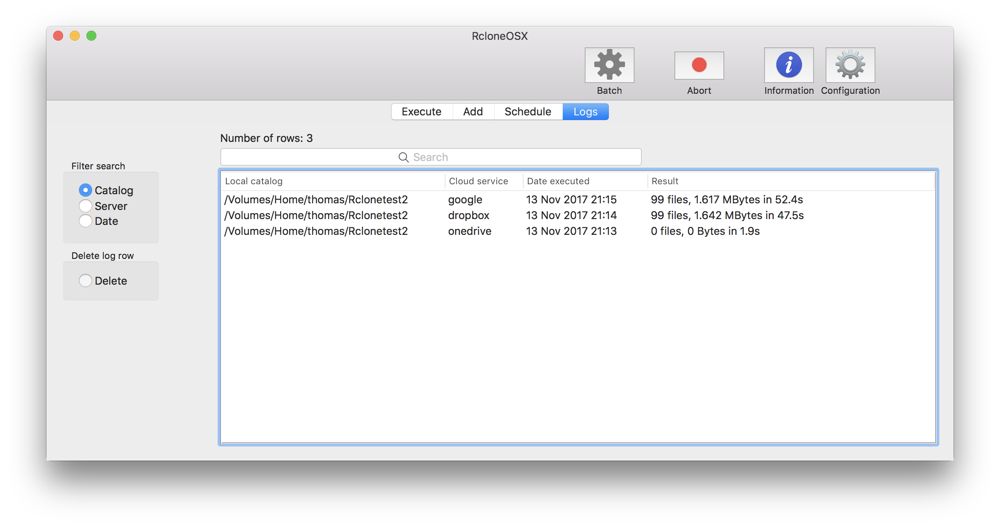
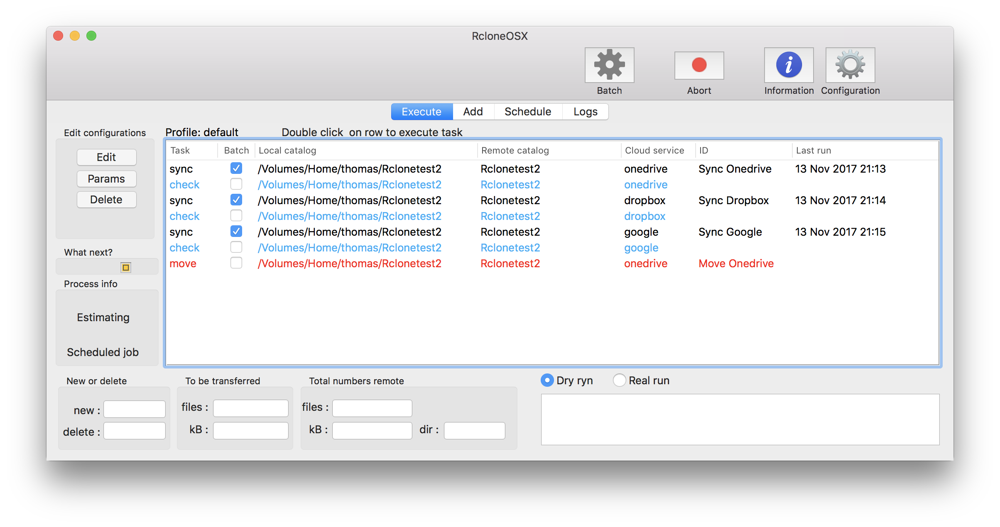

# Changelog

I have commenced a new project adapting RsyncOSX to RcloneOSX. RcloneOSX is, when it is released in version 1.0.0, utilizing the [rclone](https://rclone.org) command line tool for backup/copy files to various number of cloud storage services as Dropbox.

A short [intro](https://rsyncosx.github.io/Documentation/docs/RcloneOSX/Intro/Intro.html) about what RcloneOSX is.

See also the [intro](https://rsyncosx.github.io/Documentation/docs/Intro.html) to RsyncOSX for more info about how RcloneOSX is working. Most of the functions are equal as RcloneOSX is built by adapting code from RsyncOSX.

## Next version 0.1.5

* released 13 Nov 2017
* bugfixes
* color rows in main table (`check` task in blue and `move` tasks in red)
* initial statistics and numbers are working
* only tasks `sync`, `copy` and `move` adding logs

Testing batch and logging numbers. Only tasks `sync` and `copy` allowed for batch (as well as scheduled tasks).

Tasks are updated with last execution dates.

## Version 0.0.3

* released 11 Nov 2017
* fixed a couple of bugs
* added command `check`
* only `sync`and `copy` tasks allowed executing in batch and by schedule
  - command `move` may cause some unwanted effects when executed, always do a `--dry-run` before executing
  - executing single tasks is always a two step task, first a `--dry-run` and then the real task after inspecting the result of the `--dry-run` task

## Version 0.0.2

* released 10 Nov 2017
* more fixes and enhancements, all commands as `copy`, `sync` and `move` are implemented
* still alfa release, but most functions work
* still work to do regarding numbers and statistics

## Version 0.0.1

By a couple of hours work with RcloneOSX I managed to do a `rclone copy` of a local directory to remote directory at Dropbox and Microsoft Onedrive. The Numbers part does not work yet because the output from `rclone` is quite different compared to `rsync`. Below are some screenshots from testing.

Adding cloud services is done by using the command line interface `rclone config`.

### What is working v0.0.1

* only `rclone copy`
  - verified with Dropbox and Microsoft Onedrive, expect others to work as well
* adding and executing single tasks
* batch tasks
* scheduled tasks
* logging tasks (only date, no numbers)
* profile, storing tasks in profiles
* change and delete configurations
* some parameters are working (just a few tests)

### What is not working v0.0.1

* numbers and statistics of transferred data
* for the moment only `rclone copy`
  - my knowlegde about rclone and its use is growing every day...
* no gui for `rclone config`
  - don't know if is possible to make a GUI for setting up rclone
  - for the moment investigating this issue is put on hold
