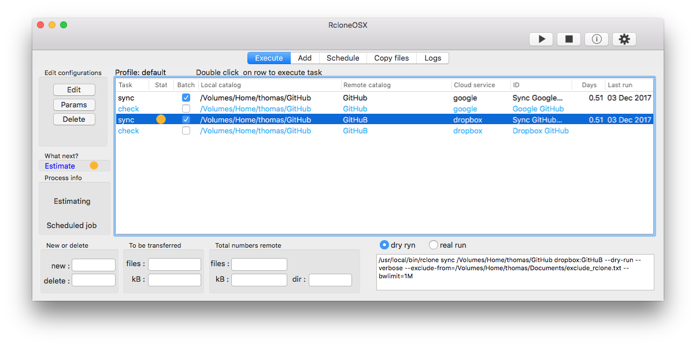
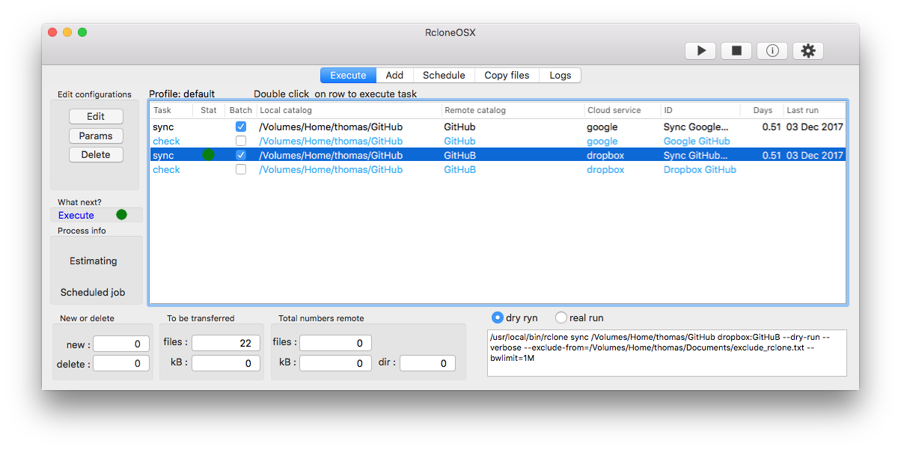
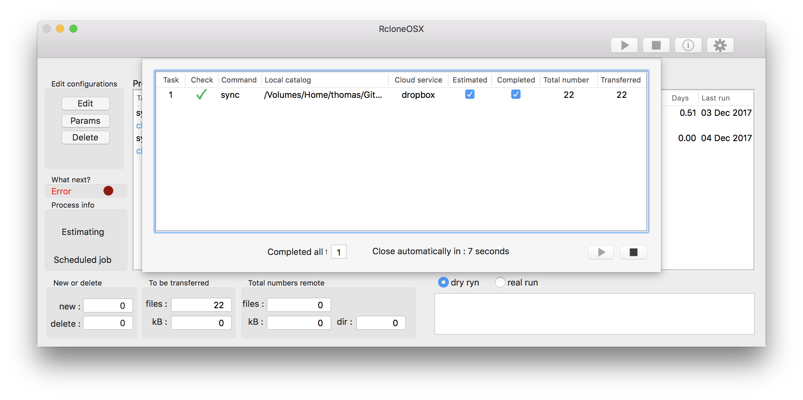

# Changelog

I have commenced a new project adapting RsyncOSX to RcloneOSX. RcloneOSX is, when it is released in version 1.0.0, utilizing the [rclone](https://rclone.org) command line tool for backup/copy files to various number of cloud storage services as Dropbox.

A short [intro](https://rsyncosx.github.io/Documentation/docs/RcloneOSX/Intro/Intro.html) about what RcloneOSX is.

See also the [intro](https://rsyncosx.github.io/Documentation/docs/Intro.html) to RsyncOSX for more info about how RcloneOSX is working. Most of the functions are equal as RcloneOSX is built by adapting code from RsyncOSX.

## Version 1.1.5

Scheduling tasks is disabled in this update. Schedules might be setup but it is not effective. Parts of the schedules needs refactor. Schedules will be enabled again when in next release.

- v1.1.5 is updated 10 Dec 2017
- focus on GUI single tasks and batch
- adding several shortcuts
	- after selecting a row the following shortcuts are effective
	- `⌘E` - shortcut for edit task
	- `⌘O` - shortcut for rclone parameters to task
	- `⌘D` - shortcut for delete task
	- `⌘R` - shortcut for immediate execute task, executing task by shortcut seems to be more effective compared execute by batch and single tasks

If a task is executed by shortcut `⌘R`, a select of another row during execution will terminate (abort) the current task. Scheduled task also might be aborted by selection the stop symbol.

## Version 1.1.1

- released 1 Dec 2017
- fixed a bug in batchview causing batch not executing properly

## Version 1.1.0

- released 28 Nov 2017
- new buttons are implemented
- fixed a typo and some minor fixes

## Version 1.0.0

- released 24 Nov 2017
- logging result after execution of tasks is fixed
- added possibility of logging, either minimum or full, output from rsync to loggfile in `Documents/rclonelog.txt`
	- the logging to file is default off when starting RcloneOSX, status of logging is not saved in userconfiguration
	- the log function appends new logs, be careful not logging all actions
- fixed some other minor glitches
- added number of days since last backup in main view

## version 0.2.5

* released 19 Nov 2017
* restore files and catalogs from cloud services
* minor bugfixes
* problem with logging is *probably* solved

## version 0.2.0

* new app icon and a few more bugfixes...
* enhancements in batchview

## Next version 0.1.5

* released 13 Nov 2017
* color rows in main table (`check` task in blue and `move` tasks in red)
* initial statistics and numbers are working
* only tasks `sync`, `copy` and `move` adding logs

## Version 0.0.3

* released 11 Nov 2017
* fixed a couple of bugs
* added command `check`
* only `sync`and `copy` tasks allowed executing in batch and by schedule
  - command `move` may cause some unwanted effects when executed, always do a `--dry-run` before executing
  - executing single tasks is always a two step task, first a `--dry-run` and then the real task after inspecting the result of the `--dry-run` task

## Version 0.0.2

* released 10 Nov 2017
* more fixes and enhancements, all commands as `copy`, `sync` and `move` are implemented
* still alfa release, but most functions work
* still work to do regarding numbers and statistics

## Version 0.0.1

By a couple of hours work with RcloneOSX I managed to do a `rclone copy` of a local directory to remote directory at Dropbox and Microsoft Onedrive. The Numbers part does not work yet because the output from `rclone` is quite different compared to `rsync`. Below are some screenshots from testing.

Adding cloud services is done by using the command line interface `rclone config`.

### What is working v0.0.1

* only `rclone copy`
  - verified with Dropbox and Microsoft Onedrive, expect others to work as well
* adding and executing single tasks
* batch tasks
* scheduled tasks
* logging tasks (only date, no numbers)
* profile, storing tasks in profiles
* change and delete configurations
* some parameters are working (just a few tests)

### What is not working v0.0.1

* numbers and statistics of transferred data
* for the moment only `rclone copy`
  - my knowlegde about rclone and its use is growing every day...
* no gui for `rclone config`
  - don't know if is possible to make a GUI for setting up rclone
  - for the moment investigating this issue is put on hold
