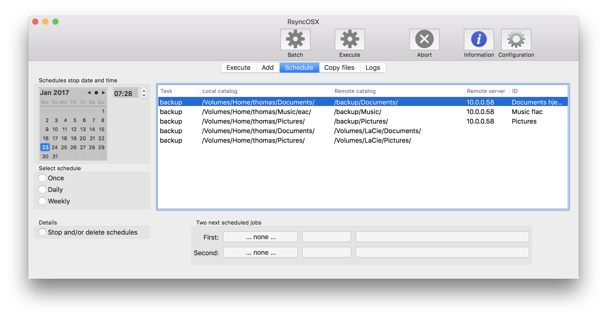
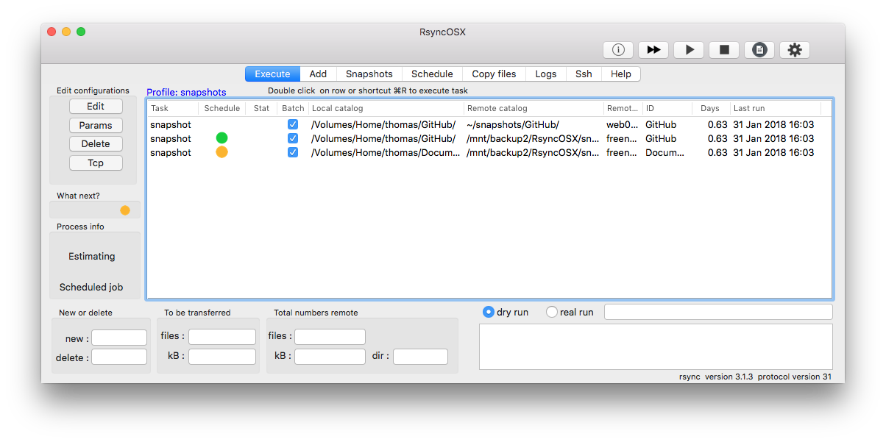
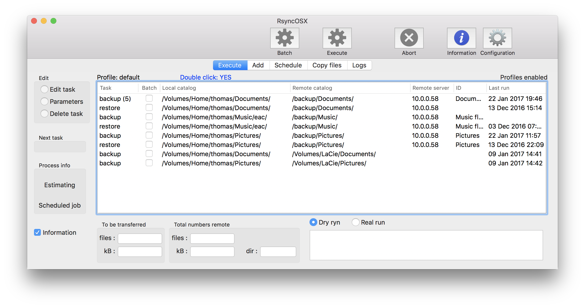
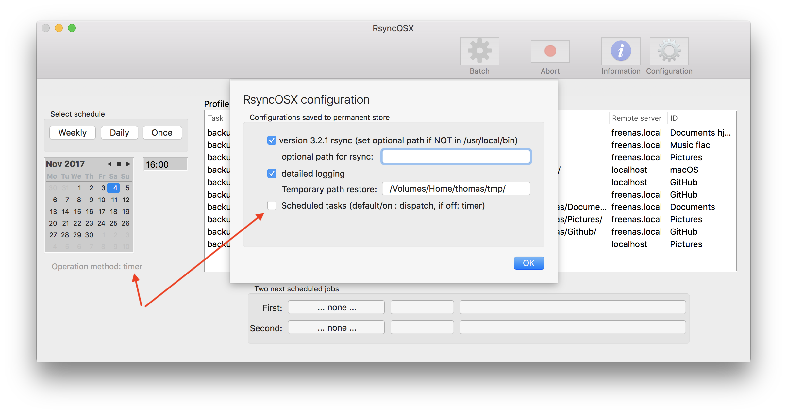

## Schedule task

Index of [RsyncOSX documentation](https://rsyncosx.github.io/Documentation/).

By selecting a row and choose schedule applies a scheduled backup to a task. There are three choices for schedules :

- Once
	- is executed _once_ at date and time given
- Daily
	- is executed _every 24-hour_ and stops at given date and time
	- first task to be excuted in 24-hours
first backup starts in 24-hour
- Weekly
	- as for daily, but _every 7 day_
	- first task to be executed in 7 days

Select task (row), set the start date and time and select the schedule (once, daily or weekly) to set up a schedule of backup. Every time RsyncOSX starts, the schedule is computed. Every time there is a change in a schedule the schedule is recomputed. The schedule is a stack of tasks. The top most element is the first task to be executed. RsyncOSX keeps track of the first task only. All other scheduled tasks remains on stack until popped of.

The stack is a reference only to a configuration (by a hidden key). The user can change anything regarding a configuration up to the moment the task is executed by schedule. If a configuration is deleted all scheduled tasks connected to configuration is deleted as well.

When the first scheduled task is _completed_, RsyncOSX checks the next top element of stack. In example the schedule *once* is selected. First scheduled backup is scheduled in one hour.

The first scheduled task is marked with a red number. The column `Start in` displays (not dynamically) when the first task is about to start. The time is updated every time the view is displayed. The column `Number` shows the number of future schedules.

In the main view the column `Schedule` a yellow or green bullet is presented if there are scheduled tasks. Green bullets when the scheduled task is about to be executed within one hour, yellow otherwise.

The number of scheduled tasks is shown in the main view as well. And the first task to be executed is marked green. When the task executes a drop down menu is presented.

By deleting the first scheduled tasks makes the next one the first.

### Stopping a scheduled task

Stopping and/or deleting tasks by selecting a row and either shortcut `⌘L` or by menu or double click on row. Either stop or delete task. If a task is deleted all logs regarding the task is deleted. The number `Logs` is how many log items there is in each schedule. Schedule with starddate `01 Jan 1900 00:00` is manually executed tasks. Schedules are sorted with most recent schedule on top.

### Method for scheduling a test

Scheduling tasks is either by `dispatch` or `timer`. To be honest I don´t know if there is any difference, but the `dispatch` is cleaner in code. And it is the default method. Both methods executes asynchronously on the main thread when executing.
* [dispatch task](https://github.com/rsyncOSX/RsyncOSX/blob/master/RsyncOSX/ScheduleOperationDispatch.swift)
* [timer task](https://github.com/rsyncOSX/RsyncOSX/blob/master/RsyncOSX/ScheduleOperationTimer.swift)

My advise is don't change. Both methods works OK. I will probably delete the `timer` method in a later release.

