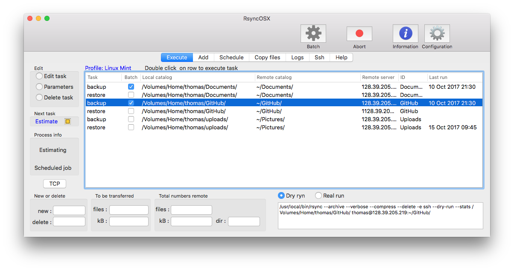
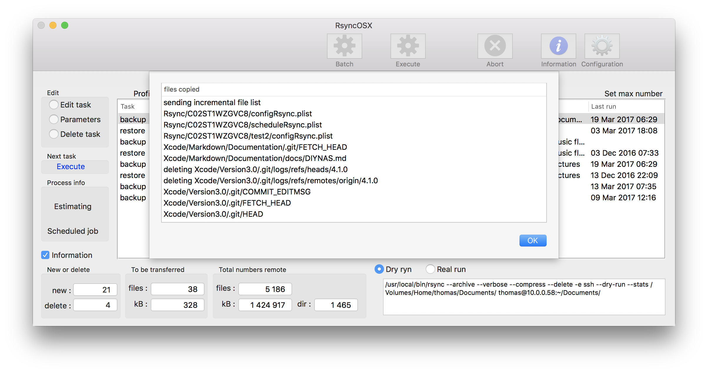
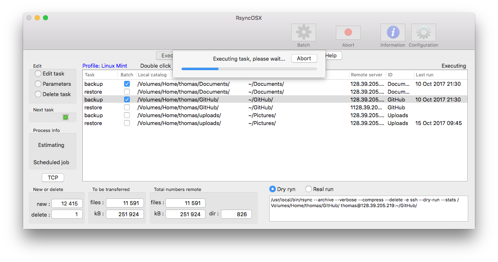
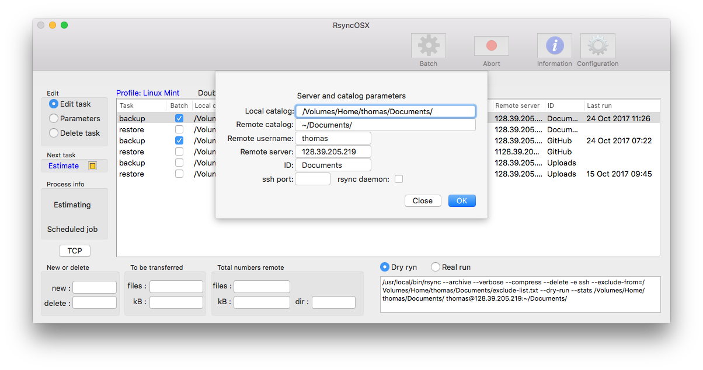

## Executing single tasks

Index of [RsyncOSX documentation](https://rsyncosx.github.io/Documentation/).

In main view (which is the opening view) tasks can be executed as **single**- and/or **batch** tasks. Execute single tasks requires selecting the Execute button twice : one for **estimation** run and the second for **executing** the real task. If the Information is on a view of output from rsync is presented after each click.

There are three options for editing after selecting a task in row :

- **Edit task** (see below)
- **Parameters** (to rsync, see [parameters](Parameters.md))
- **Delete task**

For Parameters see below. After selecting a row choosing one of the above pops up a new view according to selection. Select `Edit` task to editing basic information about task. Select `Delete` task to delete the selected row (task).

There are _some status_ fields in the view :

- **Estimate** - text is either _Estimate_ or _Execute_ - valid for single tasks only
	- "Estimate" - select `Execute` or a double click on row does a --dry-run
	- "Execute" - select `Execute` or a double click on row  does the real job (backup or restore)
- **Scheduled job** - a progress bar shows when a scheduled job is executing
- **Information** - if checked a drop down view is presented after each run - valid for single tasks only
- **Estimating** - a progress bar shows when a --dry-run (or estimate) is executing

Both "backup" and "restore" path is set when saving configuration.

## Execute single tasks

Execute single tasks is a **two step** operation, one for **estimation** (dry-run) and one for the **real task**. If the `Information` button is ticked on a popup view is automatically presented after both tasks.Single tasks can be executed either by selecting the `Execute` button or a (if enabled) double click on the selected task. Both methods is a two step operation.

The process info is updated when either a estimation task is executing or if a scheduled task is executing. There are five numbers in bottom page. Only version 3.x counts the number of remote directories. The numbers are files to be transferred and remote numbers. 

### Estimating and Executing

The actual rsync command to be executed is shown below right corner in view. It is only the estimation command which is shown. You might copy the command and paste it into a terminal for execution. You have to delete the --dry-run parameter to execute the real task.

*Next task* shows what the next task is. It shows three status : *Estimate*, *Execute* or *Abort*. If Abort is pressed any executing task is aborted. After estimate run is completed and result is checked, a real run is executed by selecting the Execute button again. If you select another row after estimation a new estimation run must be completed.

Selecting `Abort`aborts the current task.

### Edit task

To edit a task select row (task) and choose edit. Either `Close`to discard changes or `OK` to save.

