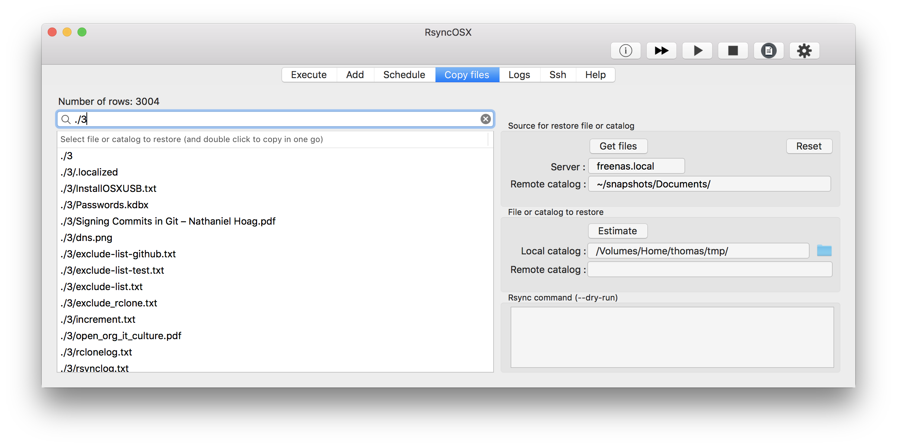

## Snapshots

Index of [RsyncOSX documentation](https://rsyncosx.github.io/Documentation/).

**Important**: the snapshot functionality is in beta yet. Use copy files function for restore of single files or catalogs. Snapshot works on attached disks (localhost) and remote hosts.

The snapshot will be like:

local catalog:
- `/Volume/home/thomas/Documents/`

remote catalog:
- `~/snapshots/Documents/1` - snapshot 1
- `~/snapshots/Documents/2` - snapshot 2
- .....
- `~/snapshots/Documents/NN` - snapshot NN
  - NN is the latest snapshot

Every snapshot is in sync with local catalog at the time of creating the snapshot. Previous versions of files can be restored from snapshots. The snapshot is set by using the `--link-dest` parameter of rsync. The parameters for snapshot is:

`--link-dest=~/snapshots/Documents/2 /Volumes/Home/thomas/Documents/ thomas@freenas.local:~/snapshots/Documents/3`

The source catalog (`/Volumes/Home/thomas/Documents/`) is **never** touched, only read by rsync.

### Create a snapshot task

### Ready for next snapshot

### Snapshots on server

The terminal view shows there are two snapshots on server. When next task is executed there are three catalogs and `current` will point `current -> 3` (automatically set by RsyncOSX).

## Search and restore

I have not yet design a search and restore special for snapshots. By using the copy files functionality single files or catalogs can be restored from snapshots.

