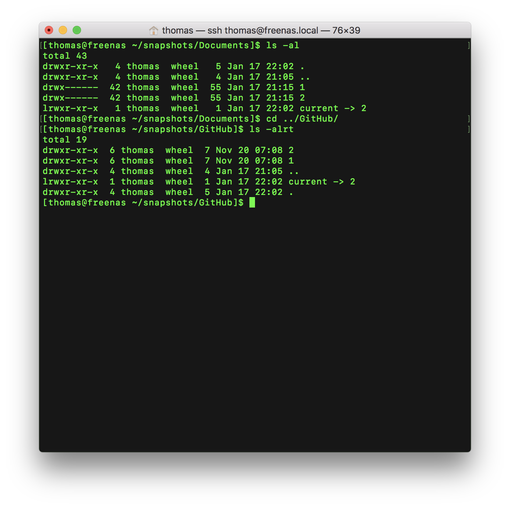

## Snapshots

Index of [RsyncOSX documentation](https://rsyncosx.github.io/Documentation/).

**Important 1**: the snapshots does **only** work on remote servers for the moment. It does **not** work on attached disks (yet).
**Important 2**: the snapshot functionality is in alpha yet, for the moment NO restore functions, only backup.

The snapshot will be like:

local catalog:
- `/Volume/home/thomas/Documents/`

remote catalog:
- `~/snapshots/Documents/01` - snapshot 1
- `~/snapshots/Documents/02` - snapshot 2
- .....
- `~/snapshots/Documents/NN` - snapshot NN
  - which is in sync with the local catalog, the `~/snapshots/Documents/current` points to the last snapshot
	- `~/snapshots/Documents/current -> ~/snapshots/Documents/NN`

Every snapshot is in sync with local catalog at the time of creating the snapshot. Previous versions of files can be restored from snapshots. The snapshot is set by using the `--link-dest` parameter of rsync. The parameters for snapshot is:

`--link-dest=~/snapshots/Documents/current /Volumes/Home/thomas/Documents/ thomas@freenas.local:~/snapshots/Documents/3`

The source catalog (`/Volumes/Home/thomas/Documents/`) is **never** touched, only read by rsync.

### Create a snapshot task

### Ready for next snapshot

### Snapshots on server

The terminal view shows there are two snapshots on server. When next task is executed there are three catalogs and `current` will point `current -> 3` (automatically set by RsyncOSX).

