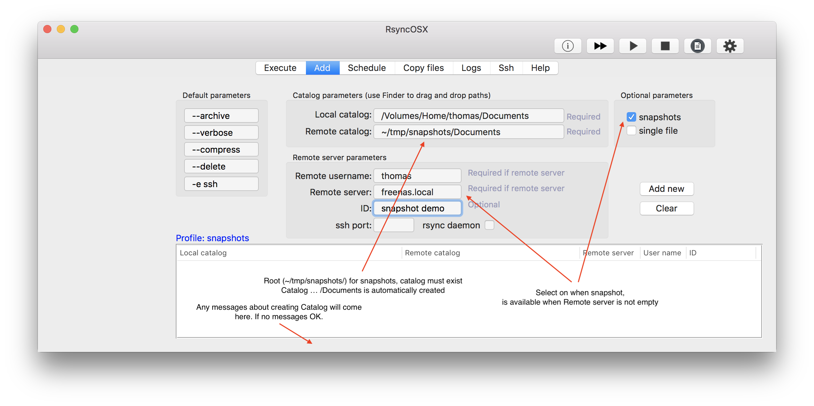
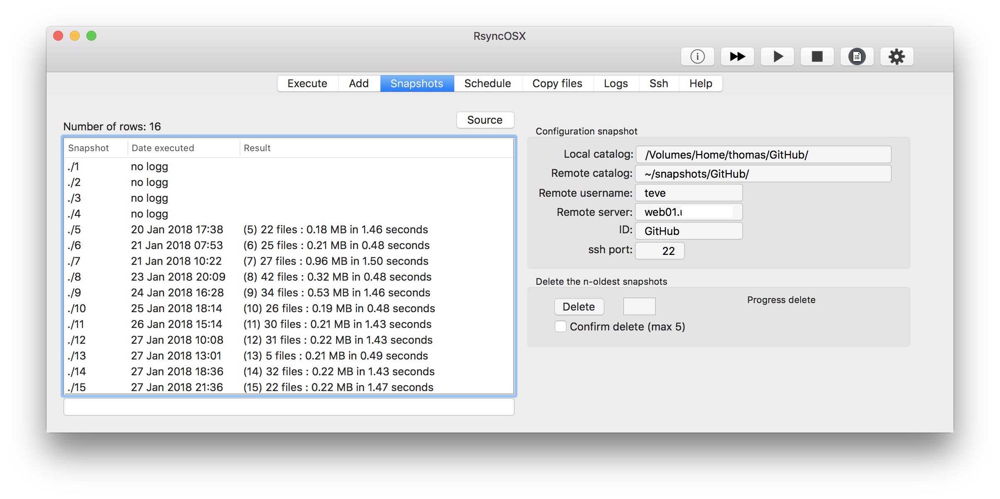
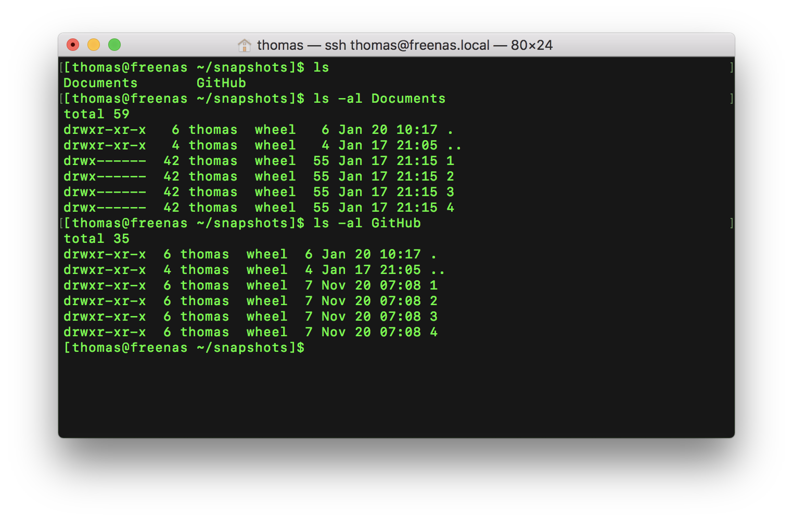

## Snapshots

Index of [RsyncOSX documentation](https://rsyncosx.github.io/Documentation/).

## Some notes about the snapshot feature

The snapshot functionality is new, please read about it before using it.
- snapshots works on both local attached disks and remote hosts
- standard rsync sync tasks (backup tasks) cannot be *converted* to snapshots, creating snapshots starts with a full sync in the first snapshot catalog (`~/snapshots/catalogtobackup/1`)
- the snapshot feature utilizes the `--link-dest` parameter, please use either version 3.1.2 or 3.1.3 of [rsync](https://rsync.samba.org/)
  - [version 3.1.2](https://download.samba.org/pub/rsync/src/rsync-3.1.2-NEWS) of rsync fixed a bug regarding the `--link-dest` parameter
  - [version 3.1.3](https://download.samba.org/pub/rsync/src/rsync-3.1.3-NEWS) of rsync was released 28 January 2018
    - see [RsyncOSX Readme](https://github.com/rsyncOSX/RsyncOSX) if you want to compile rsync yourself
- use copy files function for restore of single files or catalogs

## How does the snapshots works?

Every snapshot is in sync with local catalog at the time of creating the snapshot. Previous versions of files can be restored from snapshots. The snapshot is by utilizing the `--link-dest` parameter of rsync. The parameters for snapshots are:

`--link-dest=~/snapshots/Documents/n-1 /Volumes/Home/thomas/Documents/ thomas@freenas.local:~/snapshots/Documents/n`

where `n` is the number of snapshots and `/Volumes/Home/thomas/Documents/` is the source catalog. The source catalog is **never** touched, only read by rsync.

The local catalog (the Documents catalog as sample catalog) is:

- `/Volume/home/thomas/Documents/`

The remote catalogs is `~/snapshots/Documents/` and RsyncOSX creates the snapshots within the remote catalog.

- `~/snapshots/Documents/1` - snapshot 1
  - a full sync when snapshot is created
- `~/snapshots/Documents/2` - snapshot 2
  - the next snapshots saves the changed files and makes so called hard links for files not changed
- `~/snapshots/Documents/n` - snapshot n
  - n is the latest snapshot

When the old snapshots are deleted, the filesystem takes care of saving the real files which are hard linked.  In the sample above the remote catalog `~/snapshots/Documents/` is decided to be the root of snapshots.

### Create a snapshot task

Select the snapshots in optional parameters to utilize snapshots. Only the backup part is created utilizing snapshots.

### Ready for next snapshot

The rsync command shows the command to be executed. Important: **do not** copy and paste command for execution within a terminal window. RsyncOSX saves the number `n` - to the configuration - which is the next snapshot number. The number `n` is used when computing the parameter for rsync and is picked up from the configuration.

### Snapshot administration

The administration part supports delete of the oldest snapshots, max 5 at each time. After a delete the view is updated to reflect the current number of snapshot catalogs. The rows to be deleted are marked red.

### Snapshots on server

The terminal view shows there are two catalogs for snapshots on server.

## Logs, search and restore

I have not yet design a search and restore special for snapshots. By using the copy files functionality single files or catalogs can be restored from snapshots. Logs are marked with snapshot number.

Filter all files in snapshot #2.

