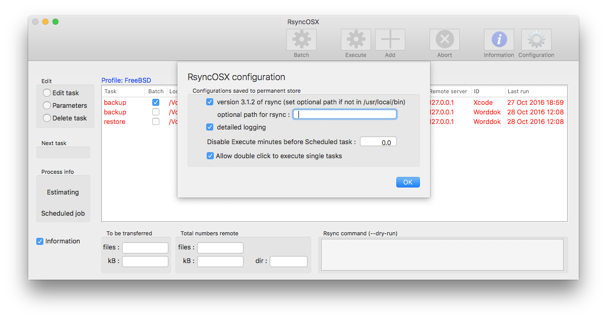
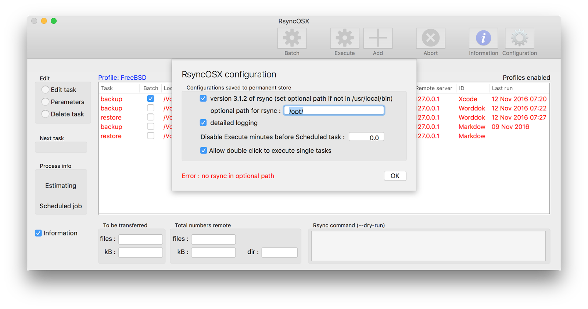
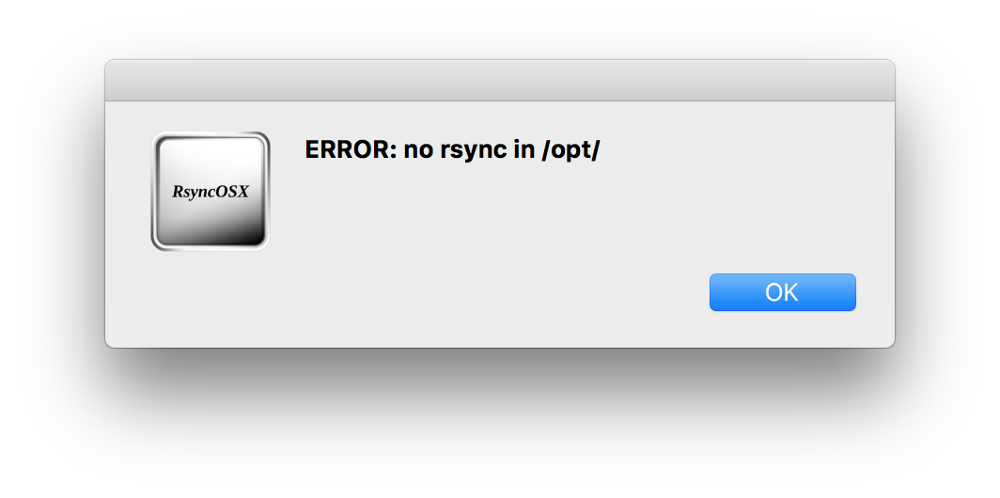

## User configuration

Index of [RsyncOSX documentation](https://rsyncosx.github.io/Documentation/).

There are only a few parameters to choose in user configuration. The three parameters are:
 
 - another version of rsync
 	- any version of rsync should work, but only _rsync  version 3.1.2  protocol version 31_ and _rsync  version 2.6.9  protocol version 29_ is tested and verified. 
 - detailed logging on or off 
 	- if detailed logging is **on** all _backup_ tasks are logged, if **off** only last date for task is updated in Execute view
 - allow double click to execute single tasks
 	- if **on** any single task might be executed by double click on a row
 
If the user selectes another version of rsync, RsyncOSX does check if there is a rsync in path set by user. If there is no rsync in path RsyncOSX will not execute any tasks. The red _configurations_ (rows in table) is only because I have not started my VirtualBox FreeBSD instance and RsyncOSX does not receive any answer (check is done automatically)

### No rsync i path

The views below is what happens if a not valid rsync path is set. First of a error is presented in bottom of user configuration.

If there is a missing rsync in optional path no execution of tasks is allowed (it gives no meaning of executing a task wihout a rsync).

