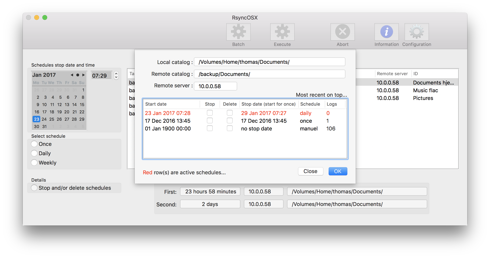

### Schedules and log records

Note : In version [4.6.0](https://github.com/rsyncOSX/RsyncOSX/tree/version4.6.0) (to be released after version 4.5.1) all singeltons are replaced by dynamic objects.

Schedules including log records are loaded into a separate data structure. Schedules and log records  [ConfigurationSchedule](https://github.com/rsyncOSX/RsyncOSX/blob/master/RsyncOSX/ConfigurationSchedule.swift) are linked to [Configuration](https://github.com/rsyncOSX/RsyncOSX/blob/master/RsyncOSX/Configuration.swift) by `hiddenID=Int`. Schedules including *log records* are saved in a separate XML-file (plist).

Manually executed task is stamped with `dateStart = 01 Jan 1900 00:00` (US-format) in the struct for schedule ([ConfigurationSchedule](https://github.com/rsyncOSX/RsyncOSX/blob/master/RsyncOSX/ConfigurationSchedule.swift)). Manually executed `schedule` is of type `manuel`. All log records for manually executed tasks are appended to this struct record. Records of scheduled backups are stamped with `dateStart` for execution, example `01 Jun 2017 22:35` and type of `schedule`, either `once`, `daily` or `monthly`. All log records of scheduled runs are appended to this struct record. And log records are linked to its schedule by a computed key.

The above is used to group log records e.g in [table view](https://rsyncosx.github.io/Documentation/docs/ScheduleTasks.html).

A log record is constructed by number of files, size of transferred files in time (`58 files : 5.04 MB in 2.50 seconds`) as reported from rsync. The output from rsync is checked and all numbers are copied from the rsync output. Every log record is linked to its parent schedule by the function `computeKey`.

A log record is appended to the schedule record as a `NSMutableDictionary`.

The object [Schedules.swift](https://github.com/rsyncOSX/RsyncOSX/blob/master/RsyncOSX/Schedules.swift) holds all data and operations working on Schedule data. The object [ScheduleWriteLoggData.swift](https://github.com/rsyncOSX/RsyncOSX/blob/master/RsyncOSX/ScheduleWriteLoggData.swift) takes care of adding and deleting log records. As for configurations, changes are applied to structure in memory and then saved to permanent storage.

When a schedule record is marked for delete, a delete flag is set on the record. When schedule data in memory is saved to permanent storage all records marked for delete are omitted. The schedules are marked dirty and a write operation is performed. All log records connected to the deleted schedule are also deleted. Schedule data in memory is wiped and reloaded from permanent storage into memory. Single log records might be deleted as well. The log record is removed in memory, schedules are marked dirty and write operation is performed.

When a schedule record is marked for delete, a delete flag is set on the record. When schedule data in memory is saved to permanent storage all records marked for delete are omitted. The schedules are marked dirty and a write operation is performed. All log records connected to the deleted schedule are also deleted. Schedule data in memory is wiped and reloaded from permanent storage into memory. Single log records might be deleted as well. The log record is removed in memory, schedules are marked dirty and write operation is performed.

### Scheduled backups

The object [ScheduleSortedAndExpanded.swift](https://github.com/rsyncOSX/RsyncOSX/blob/master/RsyncOSX/ScheduleSortedAndExpanded.swift) reads the schedules, expands scheduled tasks, sorts them by date and time and creates a result stack. The object is created every time a schedule is changed and a read from permanent storage is performed. A `daily` task which is set to kick of at 12:00 o'clock for å period of time is one record only in schedule. If this period is from mid June to mid July it is scheduled to start about 30 times during this period. When the sorted and expanded object is created only scheduled tasks with start date in future are put on stack. The first task is the first element on stack.

The scheduled task (record on stack) holds three attributes (as a `NSDictionary`) -  the `hiddenID`, which is key to task, time to start and schedule either `once`, `daily` or `monthly`.

If the object [ScheduleSortedAndExpanded.swift](https://github.com/rsyncOSX/RsyncOSX/blob/master/RsyncOSX/ScheduleSortedAndExpanded.swift) is not nil there is scheduled tasks. RsyncOSX pops off the first element of stack, calculates the number of seconds to start and creates a [Timer](https://developer.apple.com/documentation/foundation/timer) object. The timer object is set to wait for number of seconds and when time is due kick off the scheduled task. When the scheduled task is completed the next task on top of stack is popped off. Another timer object is created and waits for å number of seconds. And so forth.

If the user deletes a task any scheduled operations are deleted as well.

When a scheduled task is executing the user is not allowed to manually execute a task. RsyncOSX does also notify in view when a scheduled task is executing.

A scheduled task is object of type [Operation](https://developer.apple.com/documentation/foundation/operation). When the time is due for scheduled task to execute RsyncOSX creates an [OperationQueue](https://developer.apple.com/documentation/foundation/operationqueue) and appends the [operation object](https://github.com/rsyncOSX/RsyncOSX/blob/master/RsyncOSX/ExecuteTask.swift) to the [queue object](https://github.com/rsyncOSX/RsyncOSX/blob/master/RsyncOSX/ScheduleOperation.swift). The queue object checks that all required conditions are met before executing the `main()` method in Operation object.
