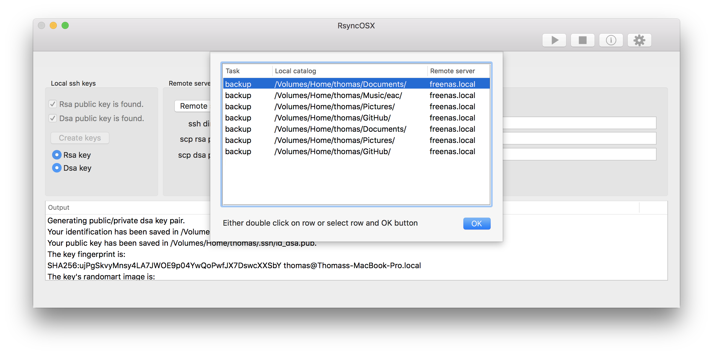
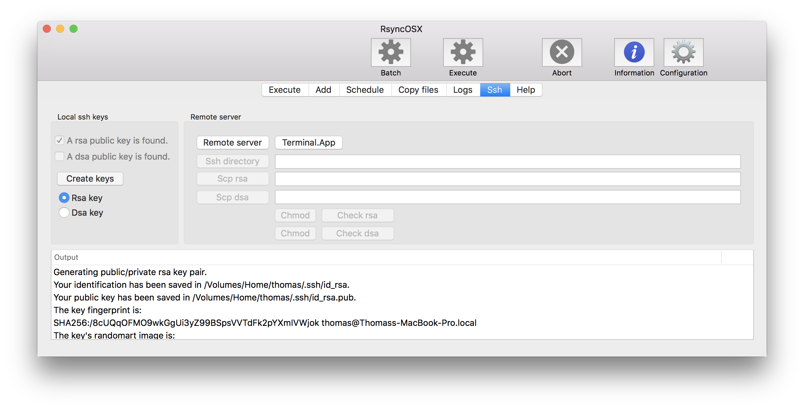
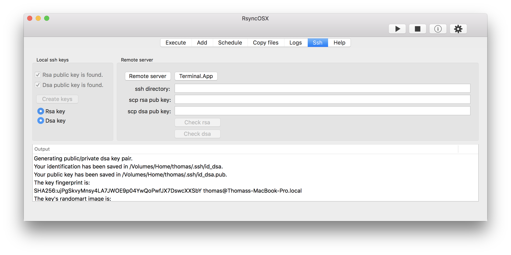
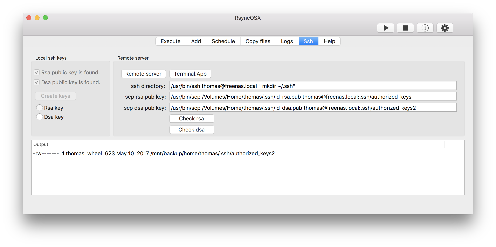

## Setup passwordless logins

Index of [RsyncOSX documentation](https://rsyncosx.github.io/Documentation/).

This `ssh` part of RsyncOSX is a kind of experimental. The objective is to assist setting up [passwordless](PasswordlessLogin.md) logins. Ssh does not provide any possibilities to pass password as parameter. Some actions to setup passwordless logins therefore require a terminal window for copy/paste commands for password prompt and execution of task.

### Local ssh keys

Below is the main view. There are **no local** public ssh keys found and keys might be created. Either choose a `rsa` or `dsa` based private and public key pair or both (once a time).

* `Rsa public key found` (if file `~/.ssh/id_rsa.pub` exists)
* `Dsa public key found` (if file `~/.ssh/id_dsa.pub` exists)
* `Create keys`, either rsa or dsa based (by `ssh-keygen`)

Which key to create and use is for you to decide. I am using the rsa based key only.

### Remote server

After local private and public ssh key pair is created choosing `Remote server` to select which remote server to setup. It is required to [add](AddConfigurations.md) configuration before setting up passwordless logins.
Either double click or select a row and `OK` button.
* `Ssh directory` - copy and paste command in Terminal.app to create remote `~/.ssh` catalog
* `Scp rsa` - copy and paste command in Terminal.app to secure copy public rsa key.
* `Scp dsa` - copy and paste command in Terminal.app to secure copy public dsa key

### Create local ssh keys

Choosing a `rsa` based key and select `Create keys`. Local keys are created by `ssh-keygen` and saved in `.ssh` local catalog. The output shows information from the `ssh-keygen` tool. If creation of local key is OK the output should be something like in view. And the `Rsa public key found` should be ticked on. Likewise for a `dsa` based key.

### Transfer public key to remote server

Next step is to manually create a remote `.ssh` catalog and `scp` (secure copy) the public key to remote server.

* `Scp rsa` - copy and paste command
  * the command `/usr/bin/scp /Volumes/Home/thomas/.ssh/id_rsa.pub thomas@freenas.local:.ssh/authorized_keys` copy the rsa public key `~/.ssh/id_rsa.pub` to remote server as file `~/.ssh/authorized_keys`
* `Scp dsa` - copy and paste command
  * the command `/usr/bin/scp /Volumes/Home/thomas/.ssh/id_dsa.pub thomas@1freenas.local:.ssh/authorized_keys2` copy the dsa public key `~/.ssh/id_dsa.pub` to remote server as file `~/.ssh/authorized_keys2`

After public key(s) are copied it is important to set correct permissions on remote public key files.

* `Check rsa` - selecting button set correct mode on file and catalog (see [passwordless](PasswordlessLogin.md) login) and executes a remote `ls -al` to list file with permissions
* `Check dsa` - as above but for the dsa public key

`chmod 600` means owner can read and write file. `chmod 700` means owner can read, write and execute
